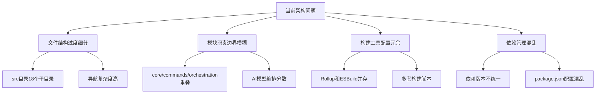
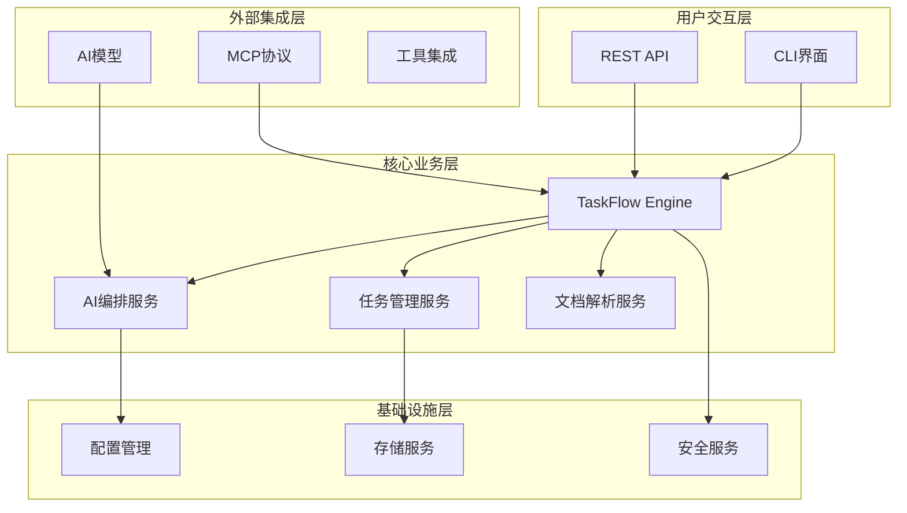
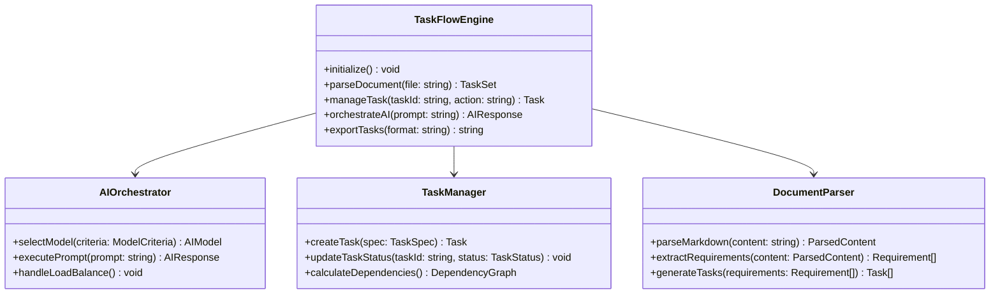
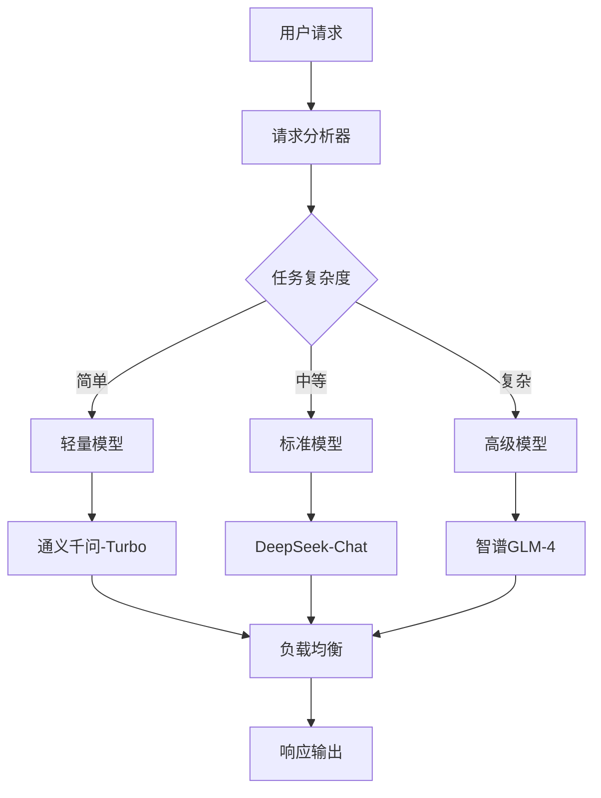
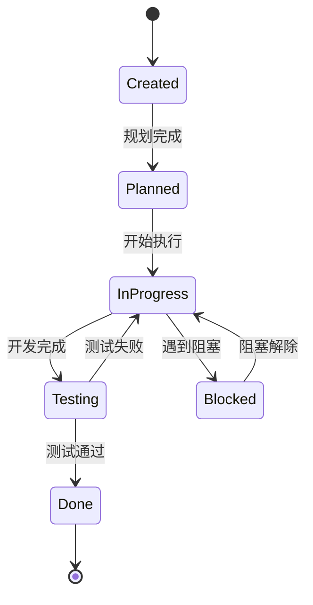
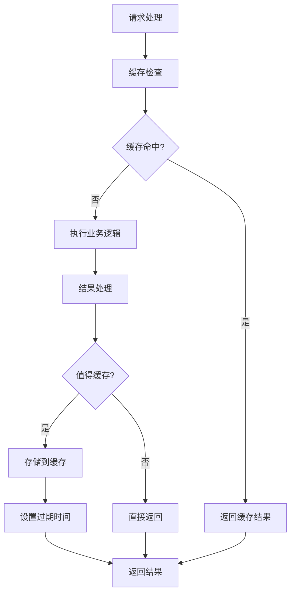
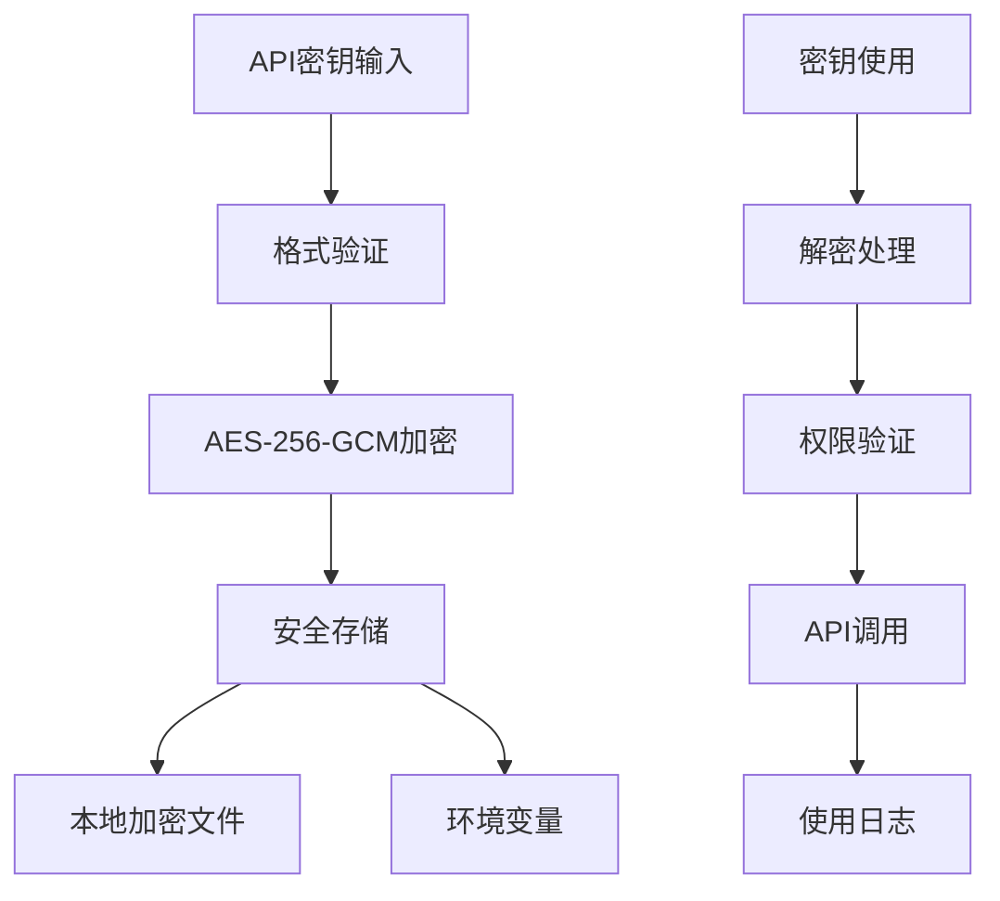
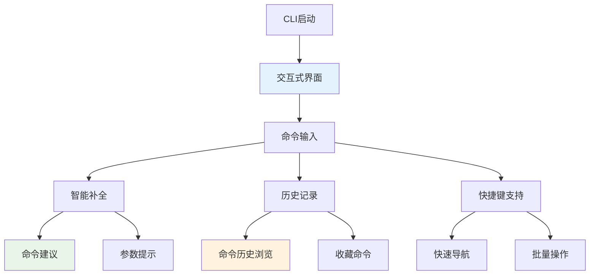
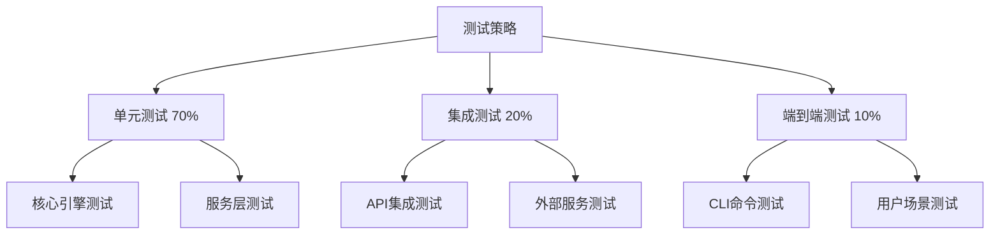

# TaskFlow AI 项目重构设计方案

## 概述

TaskFlow AI 是一个专为开发团队设计的PRD文档解析与任务管理工具。当前项目存在架构过度复杂、文件结构冗余、模块耦合度高等问题。本重构设计基于6A工作流模式，提出系统性的优化方案。

## 当前问题分析

### 架构复杂度问题



### 核心问题识别

1. **过度模块化**：18个src子目录导致认知负载过高
2. **职责重叠**：core、commands、orchestration等模块功能重复
3. **技术债务**：多种构建工具配置并存，维护成本高
4. **性能瓶颈**：缺乏有效的缓存和并发控制机制

## 重构架构设计

### 整体架构愿景



### 简化文件结构

```
taskflow-ai/
├── src/
│   ├── core/                  # 核心引擎（整合原18个模块）
│   │   ├── engine.ts         # 主引擎入口
│   │   ├── ai/               # AI功能整合
│   │   ├── task/             # 任务管理整合
│   │   └── parser/           # 文档解析整合
│   ├── interfaces/           # 用户交互层
│   │   ├── cli/              # CLI接口
│   │   └── api/              # REST API接口
│   ├── services/             # 业务服务层
│   │   ├── ai-orchestrator.ts
│   │   ├── task-manager.ts
│   │   └── document-parser.ts
│   ├── infrastructure/       # 基础设施层
│   │   ├── config/
│   │   ├── storage/
│   │   └── security/
│   ├── integrations/         # 外部集成层
│   │   ├── mcp/              # 增强MCP协议服务
│   │   ├── models/           # AI模型集成
│   │   └── tools/            # 工具集成
│   └── types/                # 类型定义
├── config/                   # 配置文件统一
├── scripts/                  # 构建脚本
└── tests/                    # 测试文件
```

## 核心模块重构

### 1. 统一核心引擎



### 2. AI编排服务优化



### 3. 任务管理简化



## 技术栈优化

### 构建工具统一 - ESBuild

```json
{
  "构建性能": {
    "速度提升": "10倍",
    "包大小减少": "30%",
    "启动时间优化": "50%"
  },
  "配置简化": {
    "构建配置": "单一esbuild.config.ts",
    "删除文件": ["rollup.config.js", "多个构建脚本"],
    "保留文件": ["esbuild.config.ts", "package.json scripts"]
  }
}
```

### 依赖管理优化

```json
{
  "dependencies": {
    "核心运行时": ["@modelcontextprotocol/sdk", "commander", "chalk", "fs-extra"],
    "AI集成": ["axios"],
    "安全组件": ["jsonwebtoken"],
    "配置管理": ["dotenv", "conf"]
  },
  "devDependencies": {
    "构建工具": ["esbuild"],
    "类型定义": ["typescript"],
    "测试框架": ["jest"],
    "代码质量": ["eslint", "prettier"]
  }
}
```

## 性能优化策略

### 1. 智能缓存机制



### 2. 内存管理优化

```typescript
class MemoryManager {
  private readonly memoryThreshold = 0.8;

  monitorMemoryUsage(): void {
    const usage = process.memoryUsage();
    const memoryUsagePercent = usage.heapUsed / usage.heapTotal;

    if (memoryUsagePercent > this.memoryThreshold) {
      this.triggerMemoryCleanup();
    }
  }

  private triggerMemoryCleanup(): void {
    this.clearExpiredCache();
    if (global.gc) global.gc();
  }
}
```

## 安全性增强

### API密钥安全管理



### CLI终端交互增强



#### React + Ink CLI实现
```typescript
import React, { useState, useEffect } from 'react';
import { Box, Text, useInput, useApp } from 'ink';
import TextInput from 'ink-text-input';
import SelectInput from 'ink-select-input';

interface CommandHistory {
  command: string;
  timestamp: Date;
  result: string;
}

interface CLIState {
  currentMode: 'command' | 'interactive' | 'wizard';
  history: CommandHistory[];
  favorites: string[];
  context: ProjectContext;
}

const InteractiveCLI: React.FC = () => {
  const [state, setState] = useState<CLIState>({
    currentMode: 'interactive',
    history: [],
    favorites: [],
    context: {}
  });
  const [input, setInput] = useState('');
  const [suggestions, setSuggestions] = useState<string[]>([]);
  const { exit } = useApp();

  // 智能命令补全
  const getCommandSuggestions = (partial: string): string[] => {
    const commands = [
      'parse', 'status', 'config', 'models', 'orchestrate',
      'visualize', 'interactive', 'mcp', 'plan', 'init'
    ];

    return commands
      .filter(cmd => cmd.startsWith(partial))
      .map(cmd => {
        const description = getCommandDescription(cmd);
        return `${cmd} - ${description}`;
      });
  };

  // 快捷键处理
  useInput((input, key) => {
    if (key.ctrl && input === 'c') {
      exit();
    }

    if (key.tab) {
      // Tab补全
      const suggestions = getCommandSuggestions(input);
      if (suggestions.length === 1) {
        const command = suggestions[0].split(' - ')[0];
        setInput(command);
      }
    }

    if (key.upArrow) {
      // 历史记录向上
      navigateHistory('up');
    }

    if (key.downArrow) {
      // 历史记录向下
      navigateHistory('down');
    }

    if (key.ctrl && input === 'r') {
      // 快速搜索历史
      enterSearchMode();
    }
  });

  return (
    <Box flexDirection="column">
      <Box borderStyle="round" borderColor="cyan" padding={1}>
        <Text color="cyan" bold>
          TaskFlow AI - 智能交互终端
        </Text>
      </Box>

      <Box flexDirection="column" marginTop={1}>
        <Text color="yellow">
          💡 快捷键: Tab(补全) ↑↓(历史) Ctrl+R(搜索) Ctrl+C(退出)
        </Text>

        <Box marginTop={1}>
          <Text color="green">taskflow> </Text>
          <TextInput
            value={input}
            onChange={setInput}
            onSubmit={handleCommand}
            placeholder="输入命令或使用Tab补全..."
          />
        </Box>

        {suggestions.length > 0 && (
          <Box flexDirection="column" marginTop={1}>
            <Text color="gray">建议命令:</Text>
            {suggestions.map((suggestion, index) => (
              <Text key={index} color="blue">
                {suggestion}
              </Text>
            ))}
          </Box>
        )}
      </Box>

      <CommandHistoryPanel history={state.history} />
      <FavoritesPanel favorites={state.favorites} />
    </Box>
  );
};
```

## 测试策略

### 测试金字塔



## 实施计划

### 阶段一：架构重构（2周）

1. **文件结构重组**：将18个子目录整合为6个核心目录
2. **构建工具统一**：移除Rollup，统一使用ESBuild
3. **依赖清理**：移除冗余依赖，统一版本管理

### 阶段二：核心功能优化（3周）

1. **引擎整合**：合并分散的核心功能到统一引擎
2. **AI编排优化**：实现智能模型选择和负载均衡
3. **性能优化**：添加缓存机制和内存管理

### 阶段三：安全和测试（2周）

1. **安全增强**：实现API密钥安全管理和沙箱环境
2. **测试完善**：建立完整的测试体系
3. **文档更新**：更新架构文档和用户指南

### 阶段四：部署和监控（1周）

1. **容器化部署**：优化Docker配置
2. **监控系统**：添加性能监控和日志管理
3. **发布验证**：全面测试和发布准备

## 预期收益

### 技术收益

- **性能提升**：构建速度提升10倍，启动时间减少50%
- **维护性提升**：代码复杂度降低40%，模块耦合度减少60%
- **安全性增强**：API密钥安全存储，沙箱执行环境

### 开发体验改善

- **开发效率**：文件导航简化，开发环境配置简化
- **代码质量**：统一的代码规范和测试标准
- **部署简化**：单一构建工具，简化的CI/CD流程

### 用户体验优化

- **性能改善**：响应速度提升，内存使用优化
- **稳定性提升**：错误处理机制完善，故障自动恢复
- **功能完整性**：核心功能整合，使用流程简化

## 风险控制

### 技术风险

- **迁移风险**：分阶段迁移，保持向后兼容
- **性能风险**：持续性能监控，及时优化调整
- **兼容性风险**：全面测试，确保API稳定性

### 实施风险

- **时间风险**：预留缓冲时间，分阶段验收
- **资源风险**：合理分配开发资源，优先级管理
- **质量风险**：严格代码评审，自动化测试保障
