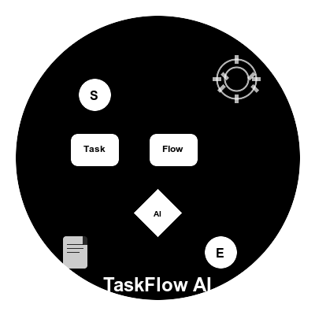

<div align="center">
  

  # TaskFlow AI

  
  
  
  
  

</div>

<p align="center">
</p>

<h2 align="center">🚀 专业的CLI任务管理工具</h2>

<p align="center">
  <strong>TaskFlow AI</strong> 是专为开发团队设计的命令行任务管理工具<br>
  智能PRD文档解析与AI驱动的任务编排，提升团队开发效率<br>
  支持多种国产大模型，实现从需求到任务的智能转换
</p>

<p align="center">
  <a href="#快速开始">快速开始</a> •
  <a href="#功能特性">功能特性</a> •
  <a href="#安装指南">安装指南</a> •
  <a href="#使用文档">使用文档</a> •
  <a href="#示例项目">示例项目</a>
</p>

---

## ✨ 功能特性

### 🎯 核心能力
- 📄 **智能PRD解析** - 自动解析产品需求文档，提取关键需求点和依赖关系
- 🤖 **AI任务编排** - 智能分析任务优先级，自动生成最优开发路径
- 🔄 **任务流程管理** - 完整的任务生命周期管理，支持状态跟踪和进度监控
- 📊 **可视化规划** - 甘特图、依赖关系图等多种可视化展示

### 🛠️ 技术特性
- 🔧 **MCP服务支持** - 作为MCP服务在AI编辑器中无缝运行
- 🤖 **国产大模型集成** - 深度集成DeepSeek、智谱GLM、通义千问等国产大模型
- 🎨 **AI编辑器优化** - 专为Cursor、VSCode等AI编辑器优化的配置生成
- 🌐 **本土化体验** - 完全中文界面，符合中国开发者使用习惯

### 🚀 开发效率
- ⚡ **项目初始化** - 一键生成AI编辑器配置和开发环境
- 📝 **智能代码生成** - 基于PRD自动生成代码结构和开发规范
- 🔍 **质量保证** - 集成ESLint、Prettier、TypeScript等代码质量工具
- 📈 **进度跟踪** - 实时任务进度监控和团队协作支持

## 📦 安装指南

### 系统要求
- Node.js 18.0.0 或更高版本
- npm、yarn 或 pnpm 包管理器
- 支持 Windows、macOS、Linux

### 全局安装（推荐）

```bash
# npm
npm install -g taskflow-ai

# yarn
yarn global add taskflow-ai

# pnpm
pnpm add -g taskflow-ai

# 验证安装
taskflow-ai --version
```

### 项目内安装

```bash
# npm
npm install --save-dev taskflow-ai

# yarn
yarn add --dev taskflow-ai

# pnpm
pnpm add --save-dev taskflow-ai
```

## 🚀 快速开始

### 第一步：初始化项目

```bash
# 创建新项目并生成AI编辑器配置
taskflow-ai init my-awesome-project

# 进入项目目录
cd my-awesome-project

# 查看生成的文件结构
ls -la
```

生成的项目结构：
```
my-awesome-project/
├── .cursor/              # Cursor AI 配置
├── .vscode/              # VSCode 配置
├── docs/                 # 文档目录
├── tasks/                # 任务文件目录
├── .eslintrc.json        # ESLint配置
├── .prettierrc.json      # Prettier配置
├── README.md             # 项目说明
└── taskflow.config.json  # TaskFlow配置
```

### 第二步：配置AI模型

```bash
# 配置DeepSeek API密钥（推荐，性价比高）
taskflow-ai config set models.apiKeys.deepseek "your-deepseek-api-key"

# 设置默认模型
taskflow-ai config set models.default "deepseek"

# 验证配置
taskflow-ai config list
```

### 第三步：解析PRD文档

```bash
# 解析示例PRD文档
taskflow-ai parse docs/example.md

# 生成详细的任务计划
taskflow-ai plan docs/example.md --output tasks/project-plan.json

# 查看生成的任务
taskflow-ai tasks list
```

### 第四步：生成项目文档

```bash
# 生成项目文档和开发指南
taskflow-ai docs generate

# 查看项目状态和进度
taskflow-ai status
```

## 🔧 AI编辑器集成

### Cursor AI 配置

TaskFlow AI 专为 Cursor AI 编辑器优化，提供无缝的AI助手体验：

```bash
# 初始化时自动生成Cursor配置
taskflow-ai init my-project --editor cursor

# 手动配置MCP服务
# 在 ~/.cursor/mcp.json 中添加：
{
  "mcpServers": {
    "taskflow-ai": {
      "command": "npx",
      "args": ["-y", "--package=taskflow-ai", "taskflow-mcp"],
      "env": {
        "DEEPSEEK_API_KEY": "your-api-key"
      }
    }
  }
}
```

### VSCode 配置

```bash
# 生成VSCode配置
taskflow-ai init my-project --editor vscode

# 安装推荐扩展
code --install-extension ms-vscode.vscode-typescript-next
code --install-extension esbenp.prettier-vscode
code --install-extension ms-vscode.vscode-eslint
```

## 💡 核心功能

### 🎯 智能PRD解析
自动解析产品需求文档，提取关键需求点、优先级和依赖关系

```bash
# 解析PRD文档
taskflow-ai parse ./docs/prd.md --output ./tasks/plan.json

# 支持多种格式
taskflow-ai parse ./docs/requirements.json --format json
taskflow-ai parse ./docs/spec.txt --format text
```

### 🤖 AI任务编排
基于AI算法分析任务依赖关系，自动生成最优的开发路径

```bash
# 生成智能任务计划
taskflow-ai plan ./docs/prd.md --team-size 5 --sprint-duration 14

# 优化任务顺序
taskflow-ai plan --optimize --complexity high
```

### 📊 任务管理
完整的任务生命周期管理，支持状态跟踪和进度监控

```bash
# 查看所有任务
taskflow-ai tasks list

# 更新任务状态
taskflow-ai tasks update task-001 --status completed

# 筛选任务
taskflow-ai tasks list --status in_progress --priority high
```

### 📈 可视化展示
生成甘特图、依赖关系图等多种可视化图表

```bash
# 生成甘特图
taskflow-ai visualize --type gantt --output gantt.html

# 生成依赖关系图
taskflow-ai visualize --type dependency --output deps.svg
```

## 📚 使用文档

| 文档 | 描述 | 链接 |
|------|------|------|
| 📖 快速开始指南 | 5分钟快速上手教程 | [getting-started.md](docs/getting-started.md) |
| 📋 用户使用指南 | 详细的功能说明和使用方法 | [user-guide.md](docs/user-guide.md) |
| 🔧 CLI命令参考 | 完整的命令行接口文档 | [cli-reference.md](docs/cli-reference.md) |
| 💡 使用示例 | 各种场景的使用示例 | [examples.md](docs/examples.md) |
| 🚨 故障排除 | 常见问题和解决方案 | [troubleshooting.md](docs/troubleshooting.md) |
| 📄 产品需求文档 | TaskFlow AI的完整PRD | [TaskFlow-AI-PRD.md](docs/TaskFlow-AI-PRD.md) |

## 🤖 AI模型支持

### 国产大模型集成

| 模型 | 状态 | 特点 | 推荐场景 |
|-----|------|-----|----------|
| 🚀 DeepSeek | ✅ 完全支持 | 强大的代码生成和理解能力 | 代码项目、技术文档 |
| 🧠 智谱GLM | ✅ 完全支持 | 优秀的推理和分析能力 | 复杂逻辑、业务分析 |
| 💬 通义千问 | ✅ 完全支持 | 多模态支持，长文本处理 | 产品规划、需求分析 |
| ⭐ 讯飞星火 | ✅ 完全支持 | 语音交互优化，教育场景 | 中文内容处理、教育项目 |
| 🌙 月之暗面Kimi | ✅ 完全支持 | 超长上下文，文档处理专家 | 长文档分析、信息提取 |
| 🔥 百度文心一言 | ✅ 完全支持 | 全面的知识图谱和语义理解 | 知识密集型项目 |

### 🔄 多模型协作功能

- **智能模型选择** - 根据任务复杂度自动选择最适合的模型
- **负载均衡** - 分散请求到多个模型，提升响应速度
- **故障转移** - 主模型失败时自动切换到备用模型
- **成本优化** - 智能路由到性价比最高的模型
- **性能监控** - 实时监控各模型的性能指标

### 模型配置示例

```bash
# 配置多个模型的API密钥
taskflow-ai config set models.apiKeys.deepseek "sk-your-deepseek-key"
taskflow-ai config set models.apiKeys.zhipu "your-zhipu-key"
taskflow-ai config set models.apiKeys.qwen "your-qwen-key"
taskflow-ai config set models.apiKeys.spark "your-spark-key"
taskflow-ai config set models.apiKeys.moonshot "your-moonshot-key"
taskflow-ai config set models.apiKeys.baidu "your-baidu-key"

# 设置默认模型
taskflow-ai config set models.default "deepseek"

# 启用多模型协作
taskflow-ai config set models.multiModel.enabled true
taskflow-ai config set models.multiModel.primary "deepseek"
taskflow-ai config set models.multiModel.fallback "zhipu,qwen"
taskflow-ai config set models.multiModel.loadBalancing true
taskflow-ai config set models.multiModel.costOptimization true
```

### 多模型使用示例

```bash
# 使用多模型协作解析复杂PRD
taskflow-ai parse ./docs/complex-prd.md \
  --multi-model \
  --primary deepseek \
  --fallback zhipu,qwen \
  --load-balancing \
  --cost-optimization

# 查看模型性能统计
taskflow-ai models stats --period week

# 运行模型基准测试
taskflow-ai models benchmark --models deepseek,zhipu,qwen --iterations 5

# 测试模型连接
taskflow-ai models test deepseek
```

## 🧩 示例项目

### 基础CLI用法

```bash
# 解析PRD文档
taskflow-ai parse ./docs/ecommerce-prd.md --output ./tasks/plan.json

# 查看解析结果
taskflow-ai tasks list --format table

# 生成详细的任务计划
taskflow-ai plan ./docs/ecommerce-prd.md --include-tests --output ./tasks/detailed-plan.json

# 查看项目状态
taskflow-ai status --detailed
```

### 高级用法

```bash
# 配置多个AI模型
taskflow-ai config set models.apiKeys.deepseek "your-deepseek-key"
taskflow-ai config set models.apiKeys.zhipu "your-zhipu-key"
taskflow-ai config set models.apiKeys.qwen "your-qwen-key"

# 使用多模型协作解析复杂PRD
taskflow-ai parse ./docs/complex-prd.md \
  --multi-model \
  --primary deepseek \
  --fallback zhipu \
  --output ./tasks/complex-plan.json

# 生成包含测试和文档的完整任务计划
taskflow-ai plan ./docs/prd.md \
  --include-tests \
  --include-docs \
  --team-size 5 \
  --sprint-duration 14 \
  --output ./tasks/complete-plan.json

# 任务管理和筛选
taskflow-ai tasks list --priority high --status not_started
taskflow-ai tasks filter --assignee "developer" --due-date "2024-01-31"

# 可视化任务依赖关系
taskflow-ai visualize ./tasks/complete-plan.json \
  --format mermaid \
  --output ./docs/task-flow.md
```

## 🎯 使用场景

### 适用项目类型
- 💻 **软件开发项目** - 前端、后端、全栈应用开发
- 📱 **移动应用开发** - React Native、Flutter等跨平台应用
- 🔧 **系统架构设计** - 微服务、分布式系统、云原生应用
- 🤖 **AI/ML项目** - 机器学习、深度学习、推荐系统
- 🏢 **企业级应用** - ERP、CRM、数据分析平台

### 团队规模
- 👤 **个人开发者** - 提高个人开发效率和项目管理能力
- 👥 **小团队** (2-5人) - 协调团队任务，优化开发流程
- 🏢 **中大型团队** (5-20人) - 复杂项目管理，多模块协作
- 🏭 **企业级团队** (20+人) - 大型项目规划，跨部门协作

## 🤝 参与贡献

我们欢迎所有形式的贡献！无论是代码、文档、问题反馈还是功能建议。

### 贡献方式

```bash
# 1. Fork 项目
git clone https://github.com/agions/taskflow-ai.git

# 2. 创建功能分支
git checkout -b feature/amazing-feature

# 3. 提交更改
git commit -m 'Add some amazing feature'

# 4. 推送到分支
git push origin feature/amazing-feature

# 5. 创建 Pull Request
```

### 开发指南
- 📋 [贡献指南](CONTRIBUTING.md)
- 🐛 [问题反馈](https://github.com/agions/taskflow-ai/issues)
- 💡 [功能建议](https://github.com/agions/taskflow-ai/discussions)
- 📖 [开发文档](docs/development.md)

## 📞 支持与社区

### 获取帮助
- 🐛 **问题反馈**: [GitHub Issues](https://github.com/agions/taskflow-ai/issues)
- 💬 **社区讨论**: [GitHub Discussions](https://github.com/agions/taskflow-ai/discussions)
- 📧 **邮件支持**: 1051736049@qq.com


## 📄 许可证

本项目采用 [MIT 许可证](LICENSE)。

```
MIT License

Copyright (c) 2025 Agions

Permission is hereby granted, free of charge, to any person obtaining a copy
of this software and associated documentation files (the "Software"), to deal
in the Software without restriction, including without limitation the rights
to use, copy, modify, merge, publish, distribute, sublicense, and/or sell
copies of the Software, and to permit persons to whom the Software is
furnished to do so, subject to the following conditions:

The above copyright notice and this permission notice shall be included in all
copies or substantial portions of the Software.
```

## 🔗 相关链接

- 📦 **NPM包**: [https://www.npmjs.com/package/taskflow-ai](https://www.npmjs.com/package/taskflow-ai)
- 🐙 **GitHub仓库**: [https://github.com/agions/taskflow-ai](https://github.com/agions/taskflow-ai)

---

<p align="center">
  <strong>⭐ 如果这个项目对你有帮助，请给我们一个星标！</strong><br>
  <sub>让更多开发者发现TaskFlow AI，一起构建更智能的开发流程</sub>
</p>

<p align="center">
  Made with ❤️ by <a href="https://github.com/agions">Agions</a>
</p>
