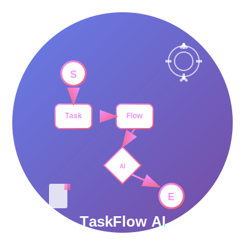

<div align="center">



# TaskFlow AI

**AI 思维流编排引擎**

[](https://github.com/Agions/taskflow-ai)
[](LICENSE)
[](https://nodejs.org/)
[](https://www.typescriptlang.org/)
[](https://modelcontextprotocol.io/)

<p align="center">
  <a href="#核心特性">核心特性</a> •
  <a href="#快速开始">快速开始</a> •
  <a href="#使用指南">使用指南</a> •
  <a href="#架构设计">架构设计</a> •
  <a href="#开发文档">开发文档</a>
</p>

</div>

---

## ✨ 核心特性

### 🧠 思维链可视化

将 AI 推理过程可视化，让思考过程一目了然：

- **多格式渲染**: Text、Markdown、Mermaid 流程图、思维导图
- **反思机制**: AI 自我审视，迭代优化结果
- **置信度评估**: 每步推理的可靠性评分
- **历史追溯**: 完整的思考链路记录

### 🤖 多模型智能路由

统一接口管理多厂商 LLM，智能选择最优模型：

| 特性 | 说明 |
|------|------|
| **统一网关** | 一个接口调用所有模型 |
| **智能路由** | smart / cost / speed / priority 策略 |
| **级联降级** | 主模型失败自动切换备选 |
| **成本估算** | 实时计算 API 费用 |

**支持模型**: DeepSeek, OpenAI, Anthropic, 智谱 GLM, 通义千问

### 📝 智能 PRD 解析

自动解析产品需求文档，生成开发任务：

- **多格式支持**: Markdown, Word, PDF
- **任务拆分**: AI 驱动的智能任务分解
- **工时估算**: 基于历史数据的预测模型
- **风险识别**: 自动识别潜在项目风险

### ⚡ 工作流引擎

声明式工作流编排，支持复杂业务逻辑：

```yaml
# 示例工作流
name: 代码审查流程
steps:
  - name: 语法检查
    type: command
    command: npm run lint
  
  - name: 类型检查
    type: command
    command: npm run type-check
  
  - name: AI 代码审查
    type: ai
    prompt: "审查以下代码: {{code}}"
    condition: "{{files.length}} > 0"
```

**特性**:
- 顺序、并行、条件分支、循环控制
- 变量替换系统 `{{variable}}`
- SQLite 状态持久化
- 错误重试与降级

### 🔌 MCP 集成

Model Context Protocol 集成，连接主流编辑器：

| 编辑器 | 状态 |
|--------|------|
| Cursor | ✅ 完整支持 |
| VSCode | ✅ 完整支持 |
| Windsurf | ✅ 完整支持 |
| Trae | ✅ 完整支持 |
| Claude Desktop | ✅ 完整支持 |

**功能**:
- 动态工具注册
- 权限控制
- 速率限制
- 工具市场

### 🧩 插件系统

可扩展的插件架构：

- **热插拔**: 运行时加载/卸载
- **钩子系统**: onInit, onTaskCreate, onWorkflowExecute
- **生命周期**: 完整的加载/卸载流程
- **API 暴露**: 插件间通信机制

### 🤖 Agent 系统

自主任务执行 Agent：

- **目标驱动**: 给定目标自动规划执行
- **反思改进**: 自我审视优化策略
- **多 Agent 协作**: 消息传递、任务分发
- **记忆系统**: 短期/长期记忆管理

---

## 🚀 快速开始

### 环境要求

- Node.js ≥ 20
- npm ≥ 10

### 安装

```bash
# 全局安装
npm install -g taskflow-ai

# 或使用 npx
npx taskflow-ai --help
```

### 初始化配置

```bash
# 初始化项目
taskflow init

# 配置 AI 模型
taskflow model add \
  --id deepseek-chat \
  --provider deepseek \
  --model deepseek-chat \
  --key YOUR_API_KEY
```

### 第一个工作流

```bash
# 创建思维链
taskflow think "如何设计一个用户认证系统"

# 解析 PRD
taskflow parse requirements.md

# 运行工作流
taskflow flow run ci-pipeline
```

---

## 📖 使用指南

### 模型管理

```bash
# 列出所有模型
taskflow model list

# 添加模型
taskflow model add -i <id> -p <provider> -m <model> -k <key>

# 测试连接
taskflow model test

# 测试路由策略
taskflow model route "帮我写个函数"

# 性能基准测试
taskflow model benchmark
```

### 思维分析

```bash
# 基础思维分析
taskflow think "分析这个技术方案"

# 可视化输出
taskflow think "设计数据库架构" --visualize

# 查看历史
taskflow think history

# 导出为 Mermaid
taskflow think "优化算法" --format mermaid
```

### 工作流管理

```bash
# 列出工作流
taskflow flow list

# 运行工作流
taskflow flow run <name>

# 创建新工作流
taskflow flow create <name>

# 查看执行历史
taskflow flow history

# 暂停/恢复
taskflow flow pause <id>
taskflow flow resume <id>
```

### PRD 解析

```bash
# 解析 Markdown
taskflow parse prd.md

# 解析 Word
taskflow parse prd.docx

# 解析 PDF
taskflow parse prd.pdf

# 导出任务
taskflow parse prd.md --output tasks.json
```

### 插件管理

```bash
# 列出插件
taskflow plugin list

# 加载插件
taskflow plugin load <id>

# 卸载插件
taskflow plugin unload <id>

# 安装插件
taskflow plugin install <package>
```

### 模板使用

```bash
# 列出模板
taskflow template list

# 使用模板
taskflow template use <id> -o output.md

# 搜索模板
taskflow template search <query>

# 创建模板
taskflow template create <name>
```

### Agent 控制

```bash
# 启动 Agent
taskflow agent start

# 发送任务
taskflow agent task "优化代码性能"

# 查看状态
taskflow agent status

# 停止 Agent
taskflow agent stop
```

### MCP 操作

```bash
# 启动 MCP 服务器
taskflow mcp start

# 列出工具
taskflow mcp tools

# 测试工具
taskflow mcp test <tool-name>

# 查看资源
taskflow mcp resources
```

---

## 🏗️ 架构设计

### 系统架构

```
┌─────────────────────────────────────────────────────────────┐
│                        CLI 层                                │
│  ┌─────────┐ ┌─────────┐ ┌─────────┐ ┌─────────┐           │
│  │  model  │ │  think  │ │  flow   │ │  agent  │           │
│  └────┬────┘ └────┬────┘ └────┬────┘ └────┬────┘           │
└───────┼───────────┼───────────┼───────────┼─────────────────┘
        │           │           │           │
        └───────────┴─────┬─────┴───────────┘
                          │
┌─────────────────────────▼───────────────────────────────────┐
│                      核心服务层                              │
│  ┌──────────┐ ┌──────────┐ ┌──────────┐ ┌──────────┐       │
│  │  AI 网关  │ │ 思维链   │ │ 工作流   │ │  Agent   │       │
│  │  Gateway │ │  Thought │ │ Workflow │ │  System  │       │
│  └────┬─────┘ └────┬─────┘ └────┬─────┘ └────┬─────┘       │
│       │            │            │            │              │
│  ┌────▼─────┐ ┌────▼─────┐ ┌────▼─────┐ ┌────▼─────┐       │
│  │  Parser  │ │  Plugin  │ │  Template│ │   MCP    │       │
│  └──────────┘ └──────────┘ └──────────┘ └──────────┘       │
└─────────────────────────────────────────────────────────────┘
                          │
┌─────────────────────────▼───────────────────────────────────┐
│                      适配器层                                │
│  ┌─────────┐ ┌─────────┐ ┌─────────┐ ┌─────────┐          │
│  │DeepSeek │ │ OpenAI  │ │Anthropic│ │  智谱   │          │
│  └─────────┘ └─────────┘ └─────────┘ └─────────┘          │
└─────────────────────────────────────────────────────────────┘
```

### 模块说明

| 模块 | 职责 | 核心文件 |
|------|------|----------|
| **AI Gateway** | 多模型统一管理 | `core/ai/gateway.ts` |
| **Thought Chain** | 思维链管理 | `core/thought/chain.ts` |
| **Workflow Engine** | 工作流执行 | `core/workflow/engine.ts` |
| **Agent System** | 自主 Agent | `core/agent/core.ts` |
| **PRD Parser** | 文档解析 | `core/parser/enhanced.ts` |
| **Plugin Manager** | 插件管理 | `core/plugin/manager.ts` |
| **MCP Server** | MCP 服务 | `mcp/server.ts` |

---

## 🛠️ 开发文档

### 项目结构

```
taskflow-ai/
├── src/
│   ├── cli/                    # CLI 入口
│   │   ├── commands/          # 命令实现
│   │   │   ├── model.ts      # 模型管理
│   │   │   ├── think.ts      # 思维分析
│   │   │   ├── flow.ts       # 工作流
│   │   │   ├── parse.ts      # PRD 解析
│   │   │   ├── agent.ts      # Agent
│   │   │   ├── plugin.ts     # 插件
│   │   │   ├── template.ts   # 模板
│   │   │   ├── mcp.ts        # MCP
│   │   │   └── ...
│   │   └── index.ts
│   │
│   ├── core/                   # 核心模块
│   │   ├── ai/                # AI 网关
│   │   ├── thought/           # 思维链
│   │   ├── workflow/          # 工作流引擎
│   │   ├── agent/             # Agent 系统
│   │   ├── plugin/            # 插件系统
│   │   └── parser/            # PRD 解析器
│   │
│   ├── mcp/                    # MCP 实现
│   │   ├── server.ts
│   │   ├── tools/
│   │   └── resources/
│   │
│   ├── types/                  # 类型定义
│   └── constants/              # 常量配置
│
├── tests/                      # 测试
├── docs/                       # 文档
├── templates/                  # 模板
└── assets/                     # 资源
```

### 开发环境

```bash
# 克隆项目
git clone https://github.com/Agions/taskflow-ai.git
cd taskflow-ai

# 安装依赖
npm install

# 开发模式
npm run dev

# 运行测试
npm test

# 代码检查
npm run lint

# 格式化
npm run format
```

### 添加新模型

```typescript
// src/core/ai/providers/custom.ts
import { AIProvider, AIRequest, AIResponse } from '../types';

export class CustomProvider implements AIProvider {
  readonly name = 'custom';
  
  async chat(request: AIRequest): Promise<AIResponse> {
    // 实现模型调用
  }
}
```

### 创建插件

```typescript
// my-plugin.ts
import { Plugin, PluginContext } from 'taskflow-ai';

export default class MyPlugin implements Plugin {
  name = 'my-plugin';
  version = '1.0.0';
  
  async onInit(ctx: PluginContext) {
    console.log('Plugin initialized');
  }
  
  async onTaskCreate(task: Task) {
    // 任务创建钩子
  }
}
```

---

## 📝 更新日志

### v2.1.0 (2026-02-22)

- ✨ 新增 Agent 系统
- 🔌 MCP 集成增强
- 🧠 思维链可视化优化
- ⚡ 工作流性能提升

### v2.0.0 (2026-01-15)

- 🎉 全新架构设计
- 🤖 多模型智能路由
- 📝 智能 PRD 解析
- 🧩 插件系统

---

## 🤝 贡献指南

欢迎提交 Issue 和 PR！

1. Fork 本仓库
2. 创建特性分支 (`git checkout -b feature/AmazingFeature`)
3. 提交更改 (`git commit -m 'Add some AmazingFeature'`)
4. 推送分支 (`git push origin feature/AmazingFeature`)
5. 创建 Pull Request

---

## 📄 许可证

[MIT](LICENSE) © 2026 TaskFlow AI Team

---

<div align="center">

**Made with ❤️ by TaskFlow AI Team**

</div>
