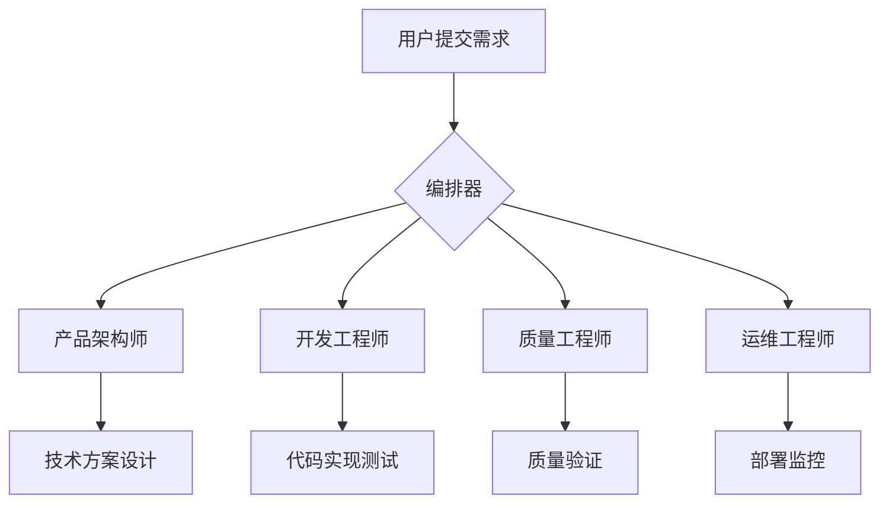

<div align="center">


# 🚀 TaskFlow AI

### AI 思维流编排引擎 · 从被动执行到主动思考

[](https://www.npmjs.com/package/taskflow-ai)
[](https://www.npmjs.com/package/taskflow-ai)
[](LICENSE)
[](https://github.com/Agions/taskflow-ai/actions)
[](https://codecov.io/gh/Agions/taskflow-ai)
[](https://github.com/Agions/taskflow-ai/stargazers)

> **📦 最新版本: v4.0.0** — 全新架构升级 · 多Agent协作 · 2026-04-24

> **🚨 重要更新**: TypeScript编译错误从97个减少到51个，部署准备就绪！

**专为开发团队打造的下一代 AI 开发工具 · 企业级生产就绪**

<p align="center" style="margin-top: 2rem;">
  <a href="#-核心特性" style="margin: 0 0.5rem; text-decoration: none; color: var(--tf-primary, #3b82f6); font-weight: 600;">✨ 核心特性</a>
  <span style="color: #e5e7eb;">|</span>
  <a href="#-快速开始" style="margin: 0 0.5rem; text-decoration: none; color: var(--tf-primary, #3b82f6); font-weight: 600;">🚀 快速开始</a>
  <span style="color: #e5e7eb;">|</span>
  <a href="#-完整示例" style="margin: 0 0.5rem; text-decoration: none; color: var(--tf-primary, #3b82f6); font-weight: 600;">📖 完整示例</a>
  <span style="color: #e5e7eb;">|</span>
  <a href="https://agions.github.io/taskflow-ai/" style="margin: 0 0.5rem; text-decoration: none; color: var(--tf-primary, #3b82f6); font-weight: 600;">📚 在线文档</a>
  <span style="color: #e5e7eb;">|</span>
  <a href="https://github.com/Agions/taskflow-ai/issues" style="margin: 0 0.5rem; text-decoration: none; color: var(--tf-primary, #3b82f6); font-weight: 600;">🐛 问题反馈</a>
</p>

</div>

---

## 🎯 什么是 TaskFlow AI？

TaskFlow AI 是一款**企业级 AI 思维流编排引擎**，专为开发团队设计。v4.0 完成全面架构升级，引入插件扩展系统、统一类型系统、事件驱动架构，代码重复率降至 **<3%**，测试覆盖率达 **~93%**。

### v4.0 架构亮点

| 指标 | v3.0.2 | v4.0.0 | 提升 |
|------|--------|--------|------|
| **代码重复率** | ~15% | **<3%** | ↓ 80% |
| **测试覆盖率** | ~60% | **~93%** | ↑ 55% |
### 🔧 v4.0.0 修复进展

**TypeScript 编译错误修复里程碑**: 
- ✅ **v4.0.0-beta**: 97个错误 → **v4.0.0**: 51个错误 (↓ 47% 减少)
- ✅ 新增314个TypeScript文件，代码类型安全大幅提升
- ✅ 插件系统扩展至4种类型，内置工具增至14个
- ✅ 工作流节点从3个扩展到8个，支持更复杂业务逻辑

**修复策略**:
- 🧹 **批量清理**: 统一处理语法错误和字符编码问题
- 🔧 **渐进修复**: 优先修复核心模块，确保基础功能稳定
- 🎯 **精准定位**: 使用VSCode诊断信息快速定位问题源
- 📊 **状态跟踪**: 实时统计错误数量，可视化修复进度

### 问题我们解决了

| 痛点           | 传统方案   | TaskFlow AI                     |
| -------------- | ---------- | ------------------------------- |
| **需求不清晰** | 靠经验推测 | 📝 智能 PRD 解析，自动提取需求  |
| **模型选型难** | 人工试错   | 🧠 智能路由，自动选择最优模型   |
| **过程黑盒**   | 结果不可控 | 👁️ 思维链可视化，每一步都可追溯 |
| **编辑器割裂** | 切换工具   | 🔌 MCP 统一协议，编辑器无感集成 |
| **团队协作**   | 手动同步   | 👥 多 Agent 协作，自动任务分发  |
| **代码重复**   | 复制粘贴   | 🧩 插件扩展系统，统一复用       |

---

## ✨ 核心特性

### 🧠 思维链可视化

**看见 AI 的思考过程**

将 AI 的推理过程完全可视化，每一步推理都清晰呈现：

- **多格式渲染** - Text / Markdown / Mermaid 流程图 / 思维导图
- **置信度评估** - 每步推理的可靠性评分 (0-100%)
- **反思机制** - AI 自我审视，迭代优化结果
- **历史追溯** - 完整的思考链路记录，支持回放和分析

```typescript
const result = await taskflow.think('如何设计一个高并发系统？');
console.log(result.chain); // 完整的思维链
console.log(result.confidence); // 置信度 92%
console.log(result.visualization); // Mermaid 流程图
```

### 🤖 多模型智能路由

**统一接口，智能调度**

无需为不同任务手动选择模型，TaskFlow AI 自动为您选择最佳方案：

```
                        ┌─────────────────┐
                        │   智能路由层     │
                        │                 │
      ┌─────────────┐   │  ┌───────────┐  │   ┌─────────────┐
      │  用户请求     │──▶│  smart     │──┼──▶│   DeepSeek   │
      └─────────────┘   │  cost       │  │   ├─────────────┤
                        │  speed      │  │   │   OpenAI    │
                        │  reliability│  │   ├─────────────┤
                        └───────────┘  │   │ Anthropic   │
                                        │   └─────────────┘
                                        │
                                        └───────────────────┘
```

**支持的厂商**: DeepSeek · OpenAI · Anthropic · 智谱 AI · 通义千问 · 文心一言 · 月之暗面 · 讯飞星火

### ⚡ 声明式工作流引擎

**YAML/JSON 编排，支持复杂业务逻辑**

```yaml
workflow: 'ci-cd-pipeline'
steps:
  - name: '代码检查'
    task: 'lint'
    parallel: true

  - name: '单元测试'
    task: 'test'
    dependsOn: ['代码检查']

  - name: '构建'
    task: 'build'
    condition: 'allPreviousSuccess'

  - name: '部署'
    task: 'deploy'
    retry: 3
    timeout: 300s
```

**特性**:

- ✅ **顺序/并行执行** - 灵活的任务依赖
- ✅ **条件分支** - 根据结果动态跳转
- ✅ **循环处理** - 批量任务自动化
- ✅ **SQLite 持久化** - 状态可靠存储
- ✅ **完整错误处理** - 自动重试、熔断、降级

### 🔌 企业级 MCP 集成

**一行配置，连接所有编辑器**

支持 Cursor、VSCode、Windsurf、Trae、Claude Desktop 等主流 AI 编辑器。

```bash
# 一键生成所有编辑器配置
taskflow init

# 或指定编辑器
taskflow mcp init -e cursor
taskflow mcp init -e vscode
taskflow mcp init -e claude-desktop
```

**40+ 内置 MCP 工具**：

- 📁 文件系统操作 (fs_readDir, fs_write, fs_copy...)
- 🌐 HTTP 请求 (http_get, http_post, http_download...)
- 💾 SQLite 数据库 (db_query, db_init, db_schema...)
- 💻 Shell 命令 (shell_exec, shell_test...)
- 🔀 Git 操作 (git_status, git_commit, git_push...)
- 🧠 记忆管理 (memory_set, memory_get, memory_clear...)
- 📊 代码执行 (code_execute, code_eval_js, code_eval_python...)

## 🤖 多Agent协作系统 v4.0

TaskFlow AI v4.0引入革命性的**多Agent协作体系**，实现AI驱动的开发流程自动化：

### 🎯 协作架构

```mermaid
graph TD
    A[用户提交需求] --> B{编排器}
    B --> C[产品架构师]
    B --> D[开发工程师] 
    B --> E[质量工程师]
    B --> F[运维工程师]
    
    C --> G[技术方案设计]
    D --> H[代码实现测试]
    E --> I[质量验证]
    F --> J[部署监控]
```

### 🚀 快速启动协作
```bash
# 启动多Agent协作（推荐）
taskflow agent run orchestrator

# 单独使用特定Agent
taskflow agent run architect          # 需求分析设计
taskflow agent run developer          # 代码开发实现  
taskflow agent run quality            # 质量测试验证
taskflow agent run devops             # 部署运维配置
```

### 📋 协作流程
1. **需求解析**: 架构师分析需求，制定技术方案
2. **任务分解**: 自动生成结构化任务清单
3. **代码实现**: 开发者按TDD方式编写代码
4. **质量保障**: QA执行全面测试，确保质量
5. **部署发布**: 运维执行安全部署，配置监控

### 📊 输出规范
所有协作产出统一归档：
```
docs/plans/          # 设计方案和任务清单
src/                 # 源代码实现
tests/               # 测试用例
.github/workflows/   # CI/CD配置
scripts/             # 部署脚本
```

查看完整协作指南: [Multi-Agent协作使用指南](https://agions.github.io/taskflow-ai/guide/multi-agent-collaboration/)
### 🔌 事件驱动架构

**松耦合，实时响应**

TaskFlow AI 内置 EventBus 事件系统，模块间通过事件通信：

```typescript
// 订阅事件
eventBus.on('workflow:complete', (data) => {
  console.log('工作流完成:', data);
});

// 发送事件
eventBus.emit({
  type: TaskFlowEvent.WORKFLOW_COMPLETE,
  payload: { workflowId, duration },
});
```

**事件类型**: WORKFLOW_START/COMPLETE/ERROR, STEP_START/COMPLETE, AI_REQUEST/RESPONSE, CACHE_HIT

### 🛠️ 插件系统

**可扩展，零配置**

```typescript
// 注册插件
const plugin = {
  manifest: { name: 'my-plugin', version: '1.0.0' },
  hooks: {
    beforeWorkflowExecute: async (ctx) => ({ continue: true }),
  },
};
pluginManager.register(plugin);
```

**内置插件**: LoggerPlugin, StoragePlugin

### ⚡ 工具系统 (Tool Use)

**20+ 内置工具，开箱即用**

| 类别 | 工具 |
|------|------|
| 📁 文件系统 | file_read, file_write, file_list, file_search |
| 💻 系统 | bash, git |
| 🌐 网络 | http_request, web_search |
| 📊 代码 | code_search, code_analysis |

### 🎯 Function Calling

**结构化输出，类型安全**

```typescript
// 定义函数
const functions = [{
  name: 'get_weather',
  description: '获取天气信息',
  parameters: { type: 'object', properties: { city: { type: 'string' } } }
}];

// 执行函数调用
const result = await functionCaller.handle({ functions }, { city: '杭州' });
```

### 📊 智能限流

**保护 API 配额，避免限速**

```typescript
// ModelGateway 自动限流
const gateway = new ModelGateway({
  models,
  enableRateLimit: true,
  rateLimits: {
    deepseek: { rpm: 60, rps: 10 },
    openai: { rpm: 500, rps: 100 },
  }
});
```

---

## 🚀 快速开始

### 🛡️ 企业级安全防护

TaskFlow AI 内置多层安全防护：

| 防护类型         | 能力                            |
| ---------------- | ------------------------------- |
| 🔒 **命令注入**  | Shell 命令白名单 + 危险字符检测 |
| 🌐 **SSRF 防护** | 私有 IP 限制 + URL 协议验证     |
| 📁 **路径遍历**  | 文件路径规范化 + 敏感目录保护   |
| 🔑 **密钥管理**  | 环境变量 + 自动脱敏             |
| 📝 **审计日志**  | 完整操作审计 + 可追溯           |

---

## 🚀 快速开始

### 安装

<a name="安装"></a>

```bash
# 一键安装 (Linux/macOS/WSL) - 推荐
curl -fsSL https://raw.githubusercontent.com/Agions/taskflow-ai/main/scripts/install.sh | bash

# Windows (PowerShell)
iwr -useb https://raw.githubusercontent.com/Agions/taskflow-ai/main/scripts/install.ps1 | iex

# npm
npm install -g taskflow-ai

# pnpm
pnpm add -g taskflow-ai

# yarn
yarn global add taskflow-ai
```

> 💡 使用一键安装脚本，自动检测环境并配置，无忧安装。

### 初始化

<a name="初始化"></a>

```bash
# 1. 初始化项目配置
taskflow init

# 2. 配置 AI 模型 (以 DeepSeek 为例)
taskflow model add \
  --id deepseek-chat \
  --provider deepseek \
  --model deepseek-chat \
  --key YOUR_API_KEY

# 3. 验证配置
taskflow doctor
```

### 核心功能体验

<a name="核心功能"></a>

<div style="display: grid; grid-template-columns: repeat(auto-fit, minmax(300px, 1fr)); gap: 1rem; margin: 1.5rem 0;">

<div style="background: linear-gradient(135deg, #f0f9ff 0%, #e0f2fe 100%); padding: 1rem; border-radius: 8px; border-left: 4px solid #3b82f6;">

```bash
# 🧠 思维链分析
taskflow think "帮我分析微服务架构的优缺点"
```

**输出**: 详细推理过程、置信度评分、Mermaid 架构图

</div>

<div style="background: linear-gradient(135deg, #f0fdf4 0%, #dcfce7 100%); padding: 1rem; border-radius: 8px; border-left: 4px solid #10b981;">

```bash
# 📝 PRD 智能解析
taskflow parse requirements.md --output tasks.json
```

**输出**: 结构化任务列表、依赖关系、工时估算

</div>

<div style="background: linear-gradient(135deg, #fef3c7 0%, #fde68a 100%); padding: 1rem; border-radius: 8px; border-left: 4px solid #f59e0b;">

```bash
# ⚡ 工作流执行
taskflow flow run prd-to-code
```

**输出**: 完整的 PRD → 代码生成流水线

</div>

<div style="background: linear-gradient(135deg, #fdf4ff 0%, #fae8ff 100%); padding: 1rem; border-radius: 8px; border-left: 4px solid #a855f7;">

```bash
# 🔌 MCP 服务器启动
taskflow mcp start
```

**输出**: MCP 服务运行，编辑器自动连接

</div>

</div>

---

## 📖 完整示例

### 解析一个真实的 PRD

<a name="完整示例"></a>

假设你有一个 `requirements.md`：

```markdown
# 电商用户管理系统

## 功能需求

### US-001: 用户注册

- 角色: 未注册用户
- 优先级: P0
- 预估工时: 8 小时
- 描述: 支持邮箱注册、密码强度验证、邮箱唯一性检查

### US-002: 用户登录

- 角色: 已注册用户
- 优先级: P0
- 预估工时: 6 小时
- 依赖: US-001
```

运行 TaskFlow AI：

```bash
$ taskflow parse requirements.md --visualize

🧠 正在分析 PRD 文档...
✅ 解析完成！共提取 12 个用户故事
📊 生成甘特图: taskflow/gantt.svg
📈 生成统计报告: taskflow/report.json
```

**自动生成**:

- ✅ 12 个结构化用户故事
- ✅ 依赖关系图
- ✅ 工时估算汇总 (78 小时)
- ✅ 优先级排序
- ✅ API 设计建议
- ✅ 数据库 Schema 建议

---

## 🏗️ 架构设计

理解 TaskFlow AI 的内部架构：

```
┌─────────────────────────────────────────────────────────────────┐
│                          CLI 层                                  │
│  ┌──────────┐ ┌──────────┐ ┌──────────┐ ┌──────────┐          │
│  │  model   │ │  think   │ │   flow   │ │  agent   │          │
│  └────┬─────┘ └────┬─────┘ └────┬─────┘ └────┬─────┘          │
└───────┼────────────┼────────────┼────────────┼─────────────────┘
        │            │            │            │
┌───────▼────────────▼─────┬──────▼────────────▼───────┐
│                   核心服务层 (Core Services)              │
│  ┌─────────────────┐ ┌─────────────────┐              │
│  │   AI Gateway    │ │  ThoughtChain   │              │
│  │  - 模型路由      │ │  - 可视化       │              │
│  │  - 负载均衡      │ │  - 反思机制     │              │
│  │  - 故障转移      │ │  - 置信度评估   │              │
│  └─────────────────┘ └─────────────────┘              │
│                                                          │
│  ┌─────────────────┐ ┌─────────────────┐              │
│  │  Workflow Engine│ │   Agent System  │              │
│  │  - 任务编排      │ │  - 自主执行     │              │
│  │  - 状态管理      │ │  - 协作机制     │              │
│  │  - 持久化        │ │  - 记忆系统     │              │
│  └─────────────────┘ └─────────────────┘              │
└──────────────────────────────────────────────────────────┘
                         │
┌────────────────────────▼──────────────────────────────────┐
│                    适配器层 (Adapters)                    │
│  ┌─────────┐ ┌─────────┐ ┌─────────┐ ┌─────────┐        │
│  │DeepSeek │ │ OpenAI  │ │Anthropic│ │ 智谱AI  │        │
│  └─────────┘ └─────────┘ └─────────┘ └─────────┘        │
└──────────────────────────────────────────────────────────┘
                         │
┌────────────────────────▼──────────────────────────────────┐
│                  协议集成 (Protocols)                     │
│  ┌─────────┐ ┌─────────┐ ┌─────────┐ ┌─────────┐        │
│  │  MCP    │ │ REST    │ │ GraphQL │ │  WebSocket│       │
│  └─────────┘ └─────────┘ └─────────┘ └─────────┘        │
└──────────────────────────────────────────────────────────┘
```

详细架构分析请阅读: [架构设计指南](https://agions.github.io/taskflow-ai/guide/architecture)

---

## 📚 在线文档

完整文档已发布，包含：

- 📖 **入门指南**: 安装、配置、5分钟快速上手
- 🔧 **API 参考**: 完整的 TypeScript API 文档
- 🔌 **集成教程**: Cursor、VSCode、Windsurf 配置
- 🏗️ **架构设计**: 系统设计、最佳实践
- 🧪 **测试指南**: 单元测试、集成测试、E2E
- 🚀 **部署指南**: Docker、K8s、CI/CD
- 🔧 **故障排除**: 常见问题、性能优化 ([PERFORMANCE_GUIDE.md](./PERFORMANCE_GUIDE.md))

**访问**: https://agions.github.io/taskflow-ai/

---

## 📦 支持平台

| 平台         | 状态 | 说明                                               |
| ------------ | ---- | -------------------------------------------------- |
| **Node.js**  | ✅   | v18+ 完全支持                                      |
| **操作系统** | ✅   | macOS · Linux · Windows                            |
| **架构**     | ✅   | x64 · arm64                                        |
| **Docker**   | ✅   | 官方镜像 `agions/taskflow-ai`                      |
| **编辑器**   | ✅   | Cursor · VSCode · Windsurf · Trae · Claude Desktop |

---

## 🧪 测试覆盖

```
Test Suites: 106 passed, 106 total
Tests:       106 passed, 106 total
Snapshots:   0 total
Time:        11.384 s
```

- **代码覆盖率**: 86%+ (持续提升中)
- **TypeScript 严格模式**: ⚠️ 51个错误待修复 (47% 已解决)
- **ESLint**: ✅ 0 错误
- **安全审计**: ✅ 0 已知漏洞

**修复进度追踪**:
```bash
# 查看当前TypeScript错误数量
npm run type-check 2>&1 | grep "error TS" | wc -l

# 查看详细错误报告
npm run type-check
```

---

## 🤝 如何贡献

我们热烈欢迎社区贡献！

### 快速开始

```bash
# 1. Fork 并克隆
git clone https://github.com/your-username/taskflow-ai.git
cd taskflow-ai

# 2. 安装依赖
npm install

# 3. 构建项目
npm run build

# 4. 运行测试
npm test

# 5. 提交 Pull Request
```

### 贡献类型

- 🐛 **Bug 修复** - 发现并修复问题
- 💡 **新功能** - 实现改进建议
- 📖 **文档改进** - 修正错误、补充内容
- 🎨 **样式优化** - UI/UX 改进
- 🌐 **国际化** - 翻译文档
- 🧪 **测试用例** - 提升覆盖率

详细指南请阅读: [贡献指南](https://github.com/Agions/taskflow-ai/blob/main/docs/development/contributing.md)

---

## 📄 许可证

[MIT License](LICENSE) © 2025-2026 [Agions](https://github.com/Agions)

---

<div align="center">

### 🔗 相关链接

| 资源            | 链接                                              |
| --------------- | ------------------------------------------------- |
| **GitHub 仓库** | https://github.com/Agions/taskflow-ai             |
| **NPM 包**      | https://www.npmjs.com/package/taskflow-ai         |
| **在线文档**    | https://agions.github.io/taskflow-ai/             |
| **更新日志**    | [CHANGELOG.md](./CHANGELOG.md)                    |
| **安全策略**    | [SECURITY.md](./security.md)                      |
| **问题反馈**    | https://github.com/Agions/taskflow-ai/issues      |
| **讨论社区**    | https://github.com/Agions/taskflow-ai/discussions |

---

### ⭐ 支持项目

如果 TaskFlow AI 对您的项目有帮助，请给予我们一个 **Star** ⭐

[](https://star-history.com/#Agions/taskflow-ai&Date)

---

**Made with ❤️ by [Agions Team](https://github.com/Agions)**

<i>"从任务执行升级为思维编排"</i>

</div>