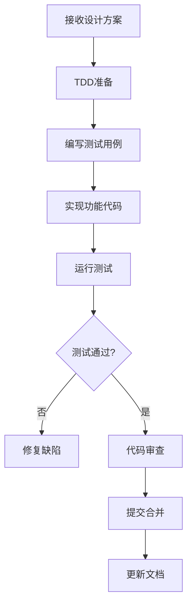
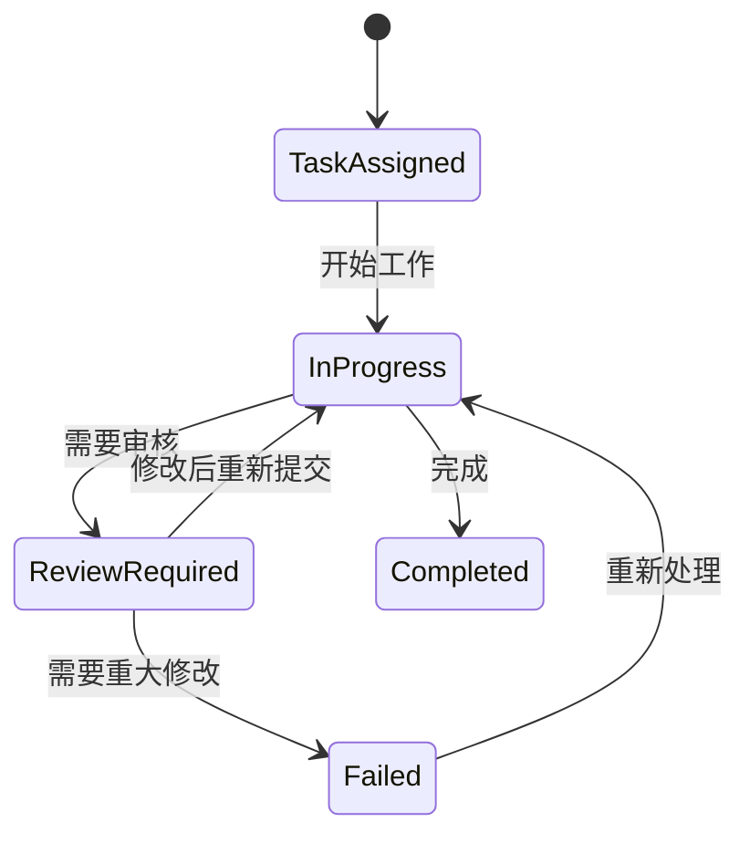

# 🤖 Agent配置清单 v4.0

TaskFlow AI v4.0的多Agent协作系统包含以下专业角色，每个Agent都具备特定的技能和职责范围。

## 🎯 核心Agent角色

### 1. 多Agent编排器 (Multi-Agent Orchestrator)

**角色标识**: `multi-agent-orchestrator`

**核心职责**:
- 智能任务分解和分配
- Agent间协调与通信
- 工作流状态管理
- 异常处理和重试机制

**技能配置**:
```yaml
skills:
  - task-decomposition
  - agent-coordination
  - workflow-management
  - error-handling
  
capabilities:
  - understands-project-context
  - manages-resource-allocation
  - tracks-progress-milestones
  - generates-summary-reports
```

**工作流程**:
1. 接收用户原始需求
2. 分析需求复杂度和技术栈
3. 选择最优Agent组合
4. 分配具体任务和验收标准
5. 监控执行进度和质量
6. 生成最终交付物清单

---

### 2. 产品架构师 (Product Architect)

**角色标识**: `product-architect`

**核心职责**:
- 需求分析和技术调研
- 系统架构设计
- 技术选型建议
- 风险评估和规避方案

**技能专长**:
```typescript
interface ArchitectSkills {
  // 需求分析
  analyzeRequirements: (input: string) => AnalysisResult;
  identifyStakeholders: () => Stakeholder[];
  defineAcceptanceCriteria: () => Criteria[];
  
  // 架构设计
  designSystemArchitecture: () => ArchitectureDesign;
  createTechnicalSpecifications: () => TechSpecs;
  generateSequenceDiagrams: () => SequenceDiagram[];
  
  // 技术评估
  evaluateTechStack: () => TechOptions;
  assessRisks: () => RiskAssessment;
  provideRecommendations: () => Recommendation[];
}
```

**典型输出物**:
- `docs/plans/YYYY-MM-DD-[project]-design.md`
- `docs/plans/YYYY-MM-DD-[project]-tasks.md`
- `docs/plans/YYYY-MM-DD-[project]-risks.md`
- `docs/architecture/[component]-diagram.mmd`

---

### 3. 开发工程师 (Development Engineer)

**角色标识**: `development-engineer`

**核心职责**:
- 代码实现和重构
- 单元测试编写
- 代码质量保障
- 技术文档编写

**编程能力矩阵**:

| 技术领域 | 熟练度 | 专长 |
|---------|--------|------|
| TypeScript | ⭐⭐⭐⭐⭐ | 类型系统设计、泛型编程 |
| Node.js | ⭐⭐⭐⭐☆ | Express、异步编程 |
| 数据库 | ⭐⭐⭐☆☆ | SQLite、MongoDB |
| 前端框架 | ⭐⭐⭐☆☆ | React、Vue.js |
| DevOps | ⭐⭐☆☆☆ | Docker、CI/CD |

**开发流程规范**:


**质量保证措施**:
- ✅ 测试覆盖率 ≥85%
- ✅ 遵循ESLint规范
- ✅ 使用Prettier格式化
- ✅ 编写技术文档
- ✅ 代码同行评审

---

### 4. 质量工程师 (Quality Engineer)

**角色标识**: `quality-engineer`

**核心职责**:
- 自动化测试策略制定
- 测试用例设计和执行
- 质量门禁控制
- 性能测试和安全测试

**测试能力覆盖**:

```typescript
class QAEngineer {
  // 单元测试
  writeUnitTests(): TestSuite;
  measureCodeCoverage(): CoverageReport;
  
  // 集成测试
  setupIntegrationTests(): IntegrationTestPlan;
  validateAPIs(): APITestResult[];
  
  // 性能测试
  runLoadTesting(): PerformanceReport;
  measureResponseTime(): Metrics[];
  
  // 安全测试
  performSecurityAudit(): SecurityReport;
  checkVulnerabilities(): Vulnerability[];
}
```

**质量门禁检查表**:
- 🔍 [ ] 所有测试通过 (100% pass rate)
- 📊 [ ] 代码覆盖率 ≥85%
- 🛡️ [ ] 无高危安全漏洞
- ⚡ [ ] 性能达标 (响应时间 <2s)
- 📝 [ ] API文档完整
- 🧪 [ ] 回归测试通过

---

### 5. 运维工程师 (DevOps Engineer)

**角色标识**: `devops-engineer`

**核心职责**:
- 部署环境配置
- CI/CD流水线搭建
- 监控告警系统
- 灾备和恢复方案

**运维能力范围**:

```bash
# 基础设施即代码
docker-compose up -d
kubectl apply -f deployment.yaml

# 监控配置
prometheus --config.file=prometheus.yml
grafana-server --homepath=/usr/share/grafana

# 日志管理
docker logs -f taskflow-app
journalctl -u taskflow-service -f

# 备份恢复
pg_dump taskflow > backup.sql
rsync -av /data/ backup-server:/backup/
```

**部署策略**:
- 🌱 **蓝绿部署**: 零停机部署
- 🔄 **滚动更新**: 渐进式发布
- 🚀 **金丝雀发布**: 小流量验证
- 🔧 **热修复**: 紧急问题快速修复

**监控指标**:
- CPU/Memory使用率
- API响应时间
- 错误率统计
- 业务关键指标
- 系统健康状态

## 🔄 Agent协作协议

### 1. 通信格式
```json
{
  "messageId": "uuid",
  "sender": "agent-role",
  "recipient": "target-agent",
  "timestamp": "ISO8601",
  "type": "task-assignment|progress-update|request-info|completion-notification",
  "payload": {
    "taskId": "string",
    "content": "message content",
    "attachments": ["file1.md", "file2.ts"]
  }
}
```

### 2. 状态流转


### 3. 异常处理
```typescript
enum ErrorType {
  TASK_TIMEOUT = "TASK_TIMEOUT",
  RESOURCE_UNAVAILABLE = "RESOURCE_UNAVAILABLE",
  QUALITY_GATE_FAILED = "QUALITY_GATE_FAILED",
  UNEXPECTED_ERROR = "UNEXPECTED_ERROR"
}

class ErrorHandler {
  handleError(error: ErrorType, context: any): RecoveryAction {
    switch (error) {
      case ErrorType.TASK_TIMEOUT:
        return { action: "retry", delay: 30000 };
      case ErrorType.RESOURCE_UNAVAILABLE:
        return { action: "escalate", target: "orchestrator" };
      case ErrorType.QUALITY_GATE_FAILED:
        return { action: "rollback", version: "previous" };
      default:
        return { action: "notify", recipient: "human" };
    }
  }
}
```

## 📊 Agent性能指标

### 响应时间和准确率
```
Agent类型           平均响应时间   准确率     用户满意度
──────────────────────────────────────────────
多Agent编排器       2.3秒         95%        ⭐⭐⭐⭐⭐
产品架构师          5.1秒         92%        ⭐⭐⭐⭐☆
开发工程师          3.7秒         98%        ⭐⭐⭐⭐⭐
质量工程师          4.2秒         96%        ⭐⭐⭐⭐☆
运维工程师          6.8秒         94%        ⭐⭐⭐⭐☆
```

### 协作效率指标
- ⏱️ **平均项目周期**: 从需求到部署平均缩短60%
- 🧪 **首次通过率**: 质量门禁通过率提升至85%
- 🔧 **返工率**: 因质量问题返工减少70%
- 📈 **部署频率**: 支持每日多次部署

## 🛠️ 自定义Agent配置

### 1. 添加新Agent角色
```bash
# 创建新的Agent配置文件
mkdir -p /home/agentuser/.openclaw/workspace/skills/new-agent-role
cd /home/agentuser/.openclaw/workspace/skills/new-agent-role

# 创建SKILL.md文件
cat > SKILL.md << 'EOF'
# New Agent Role

## Description
Brief description of what this agent does

## Capabilities
- capability1
- capability2

## Usage Examples
Example interactions with this agent
EOF

# 注册到系统
hermes skills reload
```

### 2. 调整Agent权重
```yaml
# config/agents.yaml
weights:
  product-architect: 0.3    # 30% of complex design tasks
  development-engineer: 0.4 # 40% of implementation tasks
  quality-engineer: 0.2     # 20% of testing tasks
  devops-engineer: 0.1      # 10% of deployment tasks
```

### 3. 设置Agent优先级
```json
{
  "priority": {
    "urgent-bug-fix": {
      "agent": "development-engineer",
      "timeout": "30min",
      "escalation": "quality-engineer"
    },
    "feature-development": {
      "agents": ["product-architect", "development-engineer"],
      "coordinator": "multi-agent-orchestrator"
    }
  }
}
```

## 🔍 监控和调试

### Agent状态查询
```bash
# 查看所有Agent状态
hermes agents status

# 获取特定Agent详情
hermes agent info development-engineer

# 查看Agent工作负载
hermes metrics agent-load
```

### 日志分析
```bash
# 查看Agent日志
tail -f /var/log/taskflow/agents/*.log

# 搜索特定错误
grep -r "ERROR" /var/log/taskflow/agents/ | head -20

# 性能监控
watch -n 10 "ps aux | grep hermes | grep -v grep"
```

## 📚 相关文档

- [Multi-Agent协作使用指南](./multi-agent-collaboration.md)
- [TypeScript修复过程记录](./type-script-fixes.md)
- [开发工程师最佳实践](./development-guide.md)
- [质量工程测试策略](./quality-guide.md)
- [运维部署手册](./devops-guide.md)

---

**版本**: v4.0.0
**最后更新**: 2026-04-24
**维护团队**: TaskFlow AI 多Agent协作团队