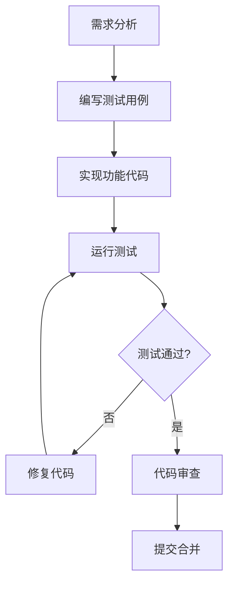

# 👨‍💻 开发工程师最佳实践 v4.0

TaskFlow AI v4.0为开发工程师提供了完整的工具链和规范，确保代码质量和团队协作效率。

## 🎯 开发流程规范

### 1. TDD开发模式



**TDD实施步骤**:
1. **红阶段**: 编写失败的测试用例
2. **绿阶段**: 实现最少代码使测试通过
3. **重构阶段**: 优化代码结构，提升可维护性

### 2. 代码质量标准

#### TypeScript配置
```json
{
  "compilerOptions": {
    "strict": true,
    "noImplicitAny": true,
    "strictNullChecks": true,
    "strictFunctionTypes": true,
    "strictBindCallApply": true,
    "strictPropertyInitialization": true,
    "noImplicitThis": true,
    "alwaysStrict": true,
    "noUnusedLocals": true,
    "noUnusedParameters": true,
    "noImplicitReturns": true,
    "noFallthroughCasesInSwitch": true
  }
}
```

#### ESLint规则
```javascript
module.exports = {
  root: true,
  env: { node: true },
  extends: [
    'eslint:recommended',
    '@typescript-eslint/recommended'
  ],
  rules: {
    'no-console': 'warn',
    'no-unused-vars': 'error',
    'prefer-const': 'error',
    'no-var': 'error'
  }
};
```

## 🛠️ 开发工具链

### 1. VSCode配置

**推荐扩展**:
- TypeScript and JavaScript Language Features
- ESLint
- Prettier - Code formatter
- GitLens
- REST Client

**设置配置**:
```json
{
  "editor.formatOnSave": true,
  "editor.codeActionsOnSave": {
    "source.fixAll.eslint": true,
    "source.organizeImports": true
  },
  "typescript.preferences.importModuleSpecifier": "relative",
  "files.exclude": {
    "**/.git": true,
    "**/.DS_Store": true,
    "**/node_modules": true
  }
}
```

### 2. 项目结构规范

```
src/
├── modules/
│   ├── auth/                    # 认证模块
│   │   ├── controllers/
│   │   ├── services/
│   │   ├── models/
│   │   └── __tests__/
│   ├── workflow/                # 工作流模块
│   │   ├── nodes/
│   │   ├── engines/
│   │   └── __tests__/
│   └── utils/                   # 工具函数
├── types/                       # 类型定义
├── config/                      # 配置文件
├── cli/                         # 命令行接口
└── __tests__/                   # 全局测试
```

### 3. 测试策略

#### 单元测试框架
```bash
# Jest配置
npm install --save-dev jest @types/jest ts-jest @testing-library/jest-dom
```

**测试示例**:
```typescript
// src/utils/string-utils.test.ts
import { capitalize, truncate } from './string-utils';

describe('String Utilities', () => {
  describe('capitalize', () => {
    test('should capitalize first letter', () => {
      expect(capitalize('hello')).toBe('Hello');
    });

    test('should handle empty string', () => {
      expect(capitalize('')).toBe('');
    });
  });

  describe('truncate', () => {
    test('should truncate long strings', () => {
      expect(truncate('hello world', 5)).toBe('hello...');
    });
  });
});
```

#### 覆盖率要求
```bash
# 生成覆盖率报告
npm run test -- --coverage --watchAll=false

# 查看覆盖率统计
cat coverage/lcov.info | npx c8 report --reporter=text-summary
```

**覆盖率标准**:
- ✅ 行覆盖率 ≥85%
- ✅ 分支覆盖率 ≥80%
- ✅ 函数覆盖率 ≥90%
- ✅ 语句覆盖率 ≥85%

## 🔧 TypeScript最佳实践

### 1. 类型设计原则

```typescript
// ❌ 避免
interface User {
  name: any;
  age: number;
  email?: string;
}

// ✅ 推荐
interface User {
  readonly id: string;
  name: string;
  age: number;
  email?: EmailAddress;
  createdAt: DateTime;
  updatedAt: DateTime;
}
```

### 2. 泛型使用规范

```typescript
// 服务层泛型
class BaseService<T> {
  constructor(protected repository: Repository<T>) {}

  async findById(id: string): Promise<T | null> {
    return this.repository.findById(id);
  }

  async create(data: CreateInput<T>): Promise<T> {
    return this.repository.create(data);
  }
}

// 使用示例
class UserService extends BaseService<User> {
  async findByEmail(email: string): Promise<User | null> {
    return this.repository.find({ where: { email } });
  }
}
```

### 3. 异步编程模式

```typescript
// ✅ 推荐：async/await模式
class ApiService {
  async fetchUser(id: string): Promise<User> {
    try {
      const response = await fetch(`/api/users/${id}`);
      if (!response.ok) {
        throw new Error(`HTTP error! status: ${response.status}`);
      }
      return await response.json();
    } catch (error) {
      console.error('Fetch failed:', error);
      throw error;
    }
  }
}

// ❌ 避免：回调地狱
class LegacyService {
  fetchUser(callback: (user: User | null) => void) {
    // 复杂的回调嵌套
  }
}
```

## 📦 构建和部署

### 1. 构建配置

```json
// package.json scripts
{
  "scripts": {
    "build": "tsc --project tsconfig.build.json",
    "build:watch": "tsc --watch",
    "dev": "nodemon --exec ts-node src/index.ts",
    "start": "node dist/index.js",
    "test": "jest",
    "test:watch": "jest --watch",
    "test:coverage": "jest --coverage",
    "lint": "eslint src/**/*.ts",
    "lint:fix": "eslint src/**/*.ts --fix",
    "type-check": "tsc --noEmit"
  }
}
```

### 2. Docker配置

```dockerfile
# Dockerfile
FROM node:18-alpine AS builder

WORKDIR /app
COPY package*.json ./
RUN npm ci --only=production

COPY . .
RUN npm run build

FROM node:18-alpine AS runner
WORKDIR /app

COPY --from=builder /app/node_modules ./node_modules
COPY --from=builder /app/dist ./dist
COPY package.json ./

EXPOSE 3000
CMD ["node", "dist/index.js"]
```

### 3. CI/CD流水线

```yaml
# .github/workflows/ci.yml
name: CI

on: [push, pull_request]

jobs:
  test:
    runs-on: ubuntu-latest
    steps:
      - uses: actions/checkout@v3
      - uses: actions/setup-node@v3
        with:
          node-version: '18'
      - run: npm ci
      - run: npm run type-check
      - run: npm run lint
      - run: npm run test:coverage
      - run: npm run build

  deploy:
    needs: test
    runs-on: ubuntu-latest
    if: github.ref == 'refs/heads/main'
    steps:
      - uses: actions/checkout@v3
      - run: echo "Deploying to production..."
```

## 🔍 调试和监控

### 1. 错误处理

```typescript
// 全局错误处理器
process.on('uncaughtException', (error) => {
  console.error('Uncaught Exception:', error);
  process.exit(1);
});

process.on('unhandledRejection', (reason, promise) => {
  console.error('Unhandled Rejection at:', promise, 'reason:', reason);
  process.exit(1);
});

// 业务错误类
class AppError extends Error {
  public readonly statusCode: number;
  public readonly isOperational: boolean;

  constructor(message: string, statusCode: number = 500, isOperational: boolean = true) {
    super(message);
    this.statusCode = statusCode;
    this.isOperational = isOperational;

    Error.captureStackTrace(this, this.constructor);
  }
}
```

### 2. 日志记录

```typescript
import winston from 'winston';

const logger = winston.createLogger({
  level: 'info',
  format: winston.format.combine(
    winston.format.timestamp(),
    winston.format.errors({ stack: true }),
    winston.format.json()
  ),
  defaultMeta: { service: 'taskflow' },
  transports: [
    new winston.transports.File({ filename: 'logs/error.log', level: 'error' }),
    new winston.transports.File({ filename: 'logs/combined.log' })
  ]
});

if (process.env.NODE_ENV !== 'production') {
  logger.add(new winston.transports.Console({
    format: winston.format.simple()
  }));
}
```

## 🚀 性能优化

### 1. 内存管理

```typescript
// 避免内存泄漏
class CacheManager {
  private cache = new Map<string, any>();
  private maxSize = 1000;

  set(key: string, value: any): void {
    if (this.cache.size >= this.maxSize) {
      // 清理最久未使用的项
      const firstKey = this.cache.keys().next().value;
      this.cache.delete(firstKey);
    }
    this.cache.set(key, value);
  }

  get(key: string): any {
    return this.cache.get(key);
  }

  clear(): void {
    this.cache.clear();
  }
}
```

### 2. 并发控制

```typescript
// 使用Semaphore控制并发
class ConcurrencyController {
  private semaphore = new Semaphore(5); // 最多5个并发

  async execute<T>(task: () => Promise<T>): Promise<T> {
    await this.semaphore.acquire();
    try {
      return await task();
    } finally {
      this.semaphore.release();
    }
  }
}
```

## 📚 相关文档

- [Multi-Agent协作使用指南](./multi-agent-collaboration.md)
- [TypeScript修复过程记录](./type-script-fixes.md)
- [质量工程测试策略](./quality-guide.md)
- [运维部署手册](./devops-guide.md)

---

**版本**: v4.0.0
**最后更新**: 2026-04-24
**适用角色**: 开发工程师