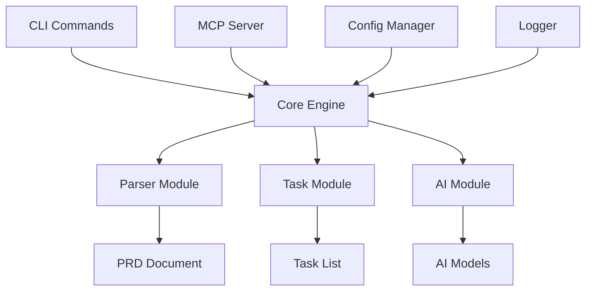

# TaskFlow AI 开发者指南

## 目录

- [开发环境搭建](#开发环境搭建)
- [项目架构](#项目架构)
- [开发工作流](#开发工作流)
- [编码规范](#编码规范)
- [测试指南](#测试指南)
- [调试技巧](#调试技巧)
- [性能优化](#性能优化)
- [贡献指南](#贡献指南)

## 开发环境搭建

### 系统要求

- **Node.js**: 18.0.0 或更高版本
- **npm**: 8.0.0 或更高版本
- **Git**: 2.25.0 或更高版本
- **操作系统**: macOS、Linux 或 Windows

### 环境搭建步骤

1. **克隆项目**

   ```bash
   git clone https://github.com/Agions/taskflow-ai.git
   cd taskflow-ai
   ```

2. **安装依赖**

   ```bash
   npm install
   ```

3. **构建项目**

   ```bash
   npm run build
   ```

4. **验证安装**
   ```bash
   ./dist/cli/index.js --version
   ```

### 开发工具推荐

#### 编辑器配置

**VSCode** (推荐)

```json
{
  "editor.formatOnSave": true,
  "editor.codeActionsOnSave": {
    "source.fixAll.eslint": true
  },
  "typescript.preferences.importModuleSpecifier": "relative",
  "files.associations": {
    "*.json": "jsonc"
  }
}
```

**必备插件:**

- TypeScript Hero
- ESLint
- Prettier
- Path Intellisense
- Auto Rename Tag

#### 终端配置

**推荐使用:**

- iTerm2 (macOS)
- Windows Terminal (Windows)
- GNOME Terminal (Linux)

**Zsh配置:**

```bash
# 安装oh-my-zsh
sh -c "$(curl -fsSL https://raw.github.com/ohmyzsh/ohmyzsh/master/tools/install.sh)"

# 推荐插件
plugins=(git node npm typescript)
```

## 项目架构

### 目录结构详解

```
src/
├── cli/                    # CLI入口和命令处理
│   ├── index.ts           # 主入口，程序启动点
│   ├── commands/          # 命令实现
│   │   ├── init.ts        # 项目初始化命令
│   │   ├── parse.ts       # PRD解析命令
│   │   ├── status.ts      # 状态查看命令
│   │   ├── visualize.ts   # 可视化生成命令
│   │   ├── mcp.ts         # MCP服务管理命令
│   │   └── config.ts      # 配置管理命令
│   └── ui/                # CLI界面组件
│       ├── prompts.ts     # 交互式提示
│       ├── progress.ts    # 进度条组件
│       └── tables.ts      # 表格显示组件
├── core/                  # 核心业务逻辑
│   ├── engine/            # 核心引擎
│   │   ├── index.ts       # 主引擎
│   │   └── processor.ts   # 数据处理器
│   ├── parser/            # PRD解析器
│   │   ├── index.ts       # 解析器入口
│   │   ├── markdown.ts    # Markdown解析
│   │   └── extractor.ts   # 内容提取器
│   ├── tasks/             # 任务管理
│   │   ├── index.ts       # 任务生成器
│   │   ├── manager.ts     # 任务管理器
│   │   └── analyzer.ts    # 依赖分析器
│   ├── ai/                # AI模型集成
│   │   ├── index.ts       # AI接口
│   │   ├── providers/     # AI提供商
│   │   └── models.ts      # 模型管理
│   └── config/            # 配置管理
│       ├── index.ts       # 配置管理器
│       └── validator.ts   # 配置验证
├── mcp/                   # MCP服务器
│   ├── server.ts          # MCP服务器核心
│   ├── tools/             # 工具注册系统
│   │   ├── index.ts       # 工具注册器
│   │   ├── file.ts        # 文件操作工具
│   │   ├── shell.ts       # Shell执行工具
│   │   └── project.ts     # 项目分析工具
│   ├── resources/         # 资源管理
│   │   ├── index.ts       # 资源管理器
│   │   └── handlers.ts    # 资源处理器
│   ├── prompts/           # 提示管理
│   │   ├── index.ts       # 提示管理器
│   │   └── templates.ts   # 提示模板
│   └── security/          # 安全管理
│       ├── auth.ts        # 认证模块
│       ├── rate-limit.ts  # 限流模块
│       └── validator.ts   # 验证模块
├── utils/                 # 通用工具
│   ├── logger.ts          # 日志工具
│   ├── file.ts            # 文件操作
│   ├── format.ts          # 格式化工具
│   ├── validation.ts      # 验证工具
│   └── helpers.ts         # 辅助函数
├── types/                 # 类型定义
│   ├── index.ts           # 导出所有类型
│   ├── config.ts          # 配置类型
│   ├── tasks.ts           # 任务类型
│   ├── prd.ts             # PRD类型
│   └── mcp.ts             # MCP类型
└── constants/             # 常量定义
    ├── index.ts           # 导出所有常量
    ├── commands.ts        # 命令常量
    ├── messages.ts        # 消息常量
    └── defaults.ts        # 默认值常量
```

### 核心模块说明

#### CLI模块 (`src/cli/`)

负责命令行界面的实现，包括：

- 命令解析和路由
- 用户交互界面
- 错误处理和用户反馈

**关键文件:**

- `index.ts`: CLI主入口，设置命令和全局配置
- `commands/*.ts`: 各个命令的具体实现
- `ui/*.ts`: 用户界面组件

#### Core模块 (`src/core/`)

核心业务逻辑实现，包括：

- PRD文档解析
- 任务生成和管理
- AI模型集成
- 配置管理

**关键文件:**

- `parser/index.ts`: PRD解析的主要逻辑
- `tasks/index.ts`: 任务生成算法
- `ai/index.ts`: AI模型调用接口

#### MCP模块 (`src/mcp/`)

Model Context Protocol服务器实现，包括：

- MCP协议处理
- 工具注册和调用
- 资源管理
- 安全控制

**关键文件:**

- `server.ts`: MCP服务器主体
- `tools/index.ts`: 工具注册系统
- `security/auth.ts`: 认证和安全

### 数据流架构



## 开发工作流

### 分支策略

我们使用 **Git Flow** 分支模型：

- `main`: 稳定发布分支
- `develop`: 开发主分支
- `feature/*`: 功能开发分支
- `release/*`: 发布准备分支
- `hotfix/*`: 紧急修复分支

### 开发流程

1. **创建功能分支**

   ```bash
   git checkout develop
   git pull origin develop
   git checkout -b feature/your-feature-name
   ```

2. **开发和测试**

   ```bash
   # 实时编译
   npm run dev

   # 运行测试
   npm test

   # 检查代码质量
   npm run lint
   npm run type-check
   ```

3. **提交代码**

   ```bash
   # 格式化代码
   npm run format

   # 提交变更
   git add .
   git commit -m "feat: add new feature"
   ```

4. **推送和PR**
   ```bash
   git push origin feature/your-feature-name
   # 在GitHub上创建Pull Request
   ```

### 提交消息规范

使用 [Conventional Commits](https://www.conventionalcommits.org/) 规范：

```
<type>[optional scope]: <description>

[optional body]

[optional footer(s)]
```

**类型说明:**

- `feat`: 新功能
- `fix`: 修复bug
- `docs`: 文档更新
- `style`: 代码格式调整
- `refactor`: 重构代码
- `test`: 测试相关
- `chore`: 构建或工具变更

**示例:**

```
feat(cli): add interactive mode for parse command

Add interactive prompts for better user experience when parsing PRD documents.

Closes #123
```

## 编码规范

### TypeScript规范

#### 类型定义

```typescript
// ✅ 好的实践
interface TaskConfig {
  readonly id: string;
  title: string;
  description?: string;
  priority: 'low' | 'medium' | 'high';
  estimatedHours: number;
}

// ❌ 避免
const taskConfig: any = {
  id: 'task-1',
  title: 'Task 1',
};
```

#### 函数定义

```typescript
// ✅ 好的实践
async function parseDocument(filePath: string, options: ParseOptions = {}): Promise<PRDDocument> {
  // 实现
}

// ❌ 避免
function parseDocument(filePath, options) {
  // 实现
}
```

#### 类和接口

```typescript
// ✅ 接口命名使用PascalCase
interface TaskManager {
  createTask(config: TaskConfig): Promise<Task>;
  updateTask(id: string, updates: Partial<TaskConfig>): Promise<Task>;
}

// ✅ 类实现
class DefaultTaskManager implements TaskManager {
  private tasks: Map<string, Task> = new Map();

  async createTask(config: TaskConfig): Promise<Task> {
    // 实现
  }

  async updateTask(id: string, updates: Partial<TaskConfig>): Promise<Task> {
    // 实现
  }
}
```

### 代码组织

#### 导入顺序

```typescript
// 1. Node.js内置模块
import { readFile } from 'fs/promises';
import path from 'path';

// 2. 第三方库
import chalk from 'chalk';
import { Command } from 'commander';

// 3. 内部模块（绝对路径）
import { Logger } from '@/utils/logger';
import { TaskConfig } from '@/types';

// 4. 相对路径导入
import { validateConfig } from './validator';
import { DEFAULT_CONFIG } from '../constants';
```

#### 导出规范

```typescript
// ✅ 命名导出（推荐）
export class TaskGenerator {}
export interface TaskConfig {}
export const DEFAULT_TIMEOUT = 30000;

// ✅ 默认导出（适用于主要功能）
export default class ConfigManager {}

// ❌ 混合导出（避免）
export default TaskGenerator;
export { TaskConfig };
```

### 错误处理

#### 自定义错误类

```typescript
export class TaskFlowError extends Error {
  constructor(
    message: string,
    public readonly code: string,
    public readonly details?: Record<string, unknown>
  ) {
    super(message);
    this.name = 'TaskFlowError';
  }
}

export class ConfigValidationError extends TaskFlowError {
  constructor(message: string, field: string) {
    super(message, 'CONFIG_VALIDATION_ERROR', { field });
  }
}
```

#### 错误处理模式

```typescript
// ✅ 使用Result模式
type Result<T, E = Error> =
  | {
      success: true;
      data: T;
    }
  | {
      success: false;
      error: E;
    };

async function parseDocument(path: string): Promise<Result<PRDDocument>> {
  try {
    const document = await parseFile(path);
    return { success: true, data: document };
  } catch (error) {
    return { success: false, error: error as Error };
  }
}
```

### 注释规范

#### JSDoc注释

````typescript
/**
 * 解析PRD文档并生成任务列表
 *
 * @param filePath - PRD文档文件路径
 * @param options - 解析选项
 * @returns Promise解析结果，包含文档信息和生成的任务
 *
 * @example
 * ```typescript
 * const result = await parseDocument('./prd.md', {
 *   generateTasks: true,
 *   aiModel: 'deepseek'
 * });
 * ```
 */
async function parseDocument(filePath: string, options: ParseOptions = {}): Promise<ParseResult> {
  // 实现
}
````

#### 代码注释

```typescript
// 配置AI模型参数
const modelConfig = {
  // 使用更低的temperature确保输出稳定性
  temperature: 0.3,
  // 限制token数量避免超出限制
  maxTokens: 2000,
};

// TODO: 添加缓存机制优化性能
// FIXME: 处理文件路径中的特殊字符
// NOTE: 这里使用同步读取是为了确保配置加载完成
```

## 测试指南

### 测试策略

我们采用金字塔测试策略：

```
     /\
    /  \  E2E Tests (10%)
   /____\
  /      \
 / Integration \ (20%)
/____Tests_____\
\              /
 \    Unit    / (70%)
  \__Tests__/
```

### 单元测试

#### 测试文件组织

```
src/
├── core/
│   ├── parser/
│   │   ├── index.ts
│   │   └── __tests__/
│   │       ├── index.test.ts
│   │       └── markdown.test.ts
│   └── tasks/
│       ├── index.ts
│       └── __tests__/
│           └── index.test.ts
```

#### 测试示例

```typescript
// src/core/parser/__tests__/index.test.ts
import { PRDParser } from '../index';
import { Logger } from '@/utils/logger';

// Mock dependencies
jest.mock('@/utils/logger');

describe('PRDParser', () => {
  let parser: PRDParser;

  beforeEach(() => {
    parser = new PRDParser({
      aiModel: 'mock-model',
    });
  });

  afterEach(() => {
    jest.clearAllMocks();
  });

  describe('parseMarkdown', () => {
    it('should parse basic markdown structure', async () => {
      const markdown = `
# Project Title
## Section 1
Content for section 1
## Section 2
Content for section 2
      `;

      const result = await parser.parseMarkdown(markdown);

      expect(result).toMatchObject({
        title: 'Project Title',
        sections: [
          { title: 'Section 1', level: 2 },
          { title: 'Section 2', level: 2 },
        ],
      });
    });

    it('should handle empty markdown', async () => {
      const result = await parser.parseMarkdown('');

      expect(result.sections).toHaveLength(0);
    });

    it('should throw error for invalid input', async () => {
      await expect(parser.parseMarkdown(null as any)).rejects.toThrow('Invalid markdown content');
    });
  });
});
```

#### 测试工具函数

```typescript
// tests/utils/helpers.ts
export function createMockConfig(overrides: Partial<TaskFlowConfig> = {}): TaskFlowConfig {
  return {
    projectName: 'Test Project',
    version: '1.0.0',
    aiModels: [],
    mcpSettings: {
      enabled: false,
      port: 3000,
      host: 'localhost',
    },
    ...overrides,
  };
}

export function createMockTask(overrides: Partial<Task> = {}): Task {
  return {
    id: 'test-task-1',
    title: 'Test Task',
    description: 'Test description',
    type: 'frontend',
    status: 'todo',
    priority: 'medium',
    complexity: 'medium',
    estimatedHours: 8,
    dependencies: [],
    tags: [],
    subtasks: [],
    progress: 0,
    createdAt: new Date(),
    updatedAt: new Date(),
    ...overrides,
  };
}
```

### 集成测试

```typescript
// tests/integration/cli.test.ts
import { execSync } from 'child_process';
import { readFileSync, writeFileSync } from 'fs';
import { tmpdir } from 'os';
import { join } from 'path';

describe('CLI Integration Tests', () => {
  let testDir: string;

  beforeEach(() => {
    testDir = join(tmpdir(), `taskflow-test-${Date.now()}`);
    execSync(`mkdir -p ${testDir}`);
    process.chdir(testDir);
  });

  afterEach(() => {
    execSync(`rm -rf ${testDir}`);
  });

  it('should initialize project successfully', () => {
    const output = execSync('taskflow init --skip-ai', { encoding: 'utf8' });

    expect(output).toContain('项目初始化成功');
    expect(readFileSync('.taskflow/config.json', 'utf8')).toBeTruthy();
  });

  it('should parse PRD document', () => {
    // 创建测试PRD文件
    const prdContent = `
# Test Project
## Feature 1
Description of feature 1
    `;
    writeFileSync('test-prd.md', prdContent);

    // 初始化项目
    execSync('taskflow init --skip-ai');

    // 解析PRD
    const output = execSync('taskflow parse test-prd.md', { encoding: 'utf8' });

    expect(output).toContain('解析完成');
    expect(readFileSync('output/tasks.json', 'utf8')).toBeTruthy();
  });
});
```

### 测试运行

```bash
# 运行所有测试
npm test

# 运行特定测试
npm test -- --testPathPattern=parser

# 运行测试并生成覆盖率报告
npm run test:coverage

# 监听模式
npm run test:watch

# 性能测试
npm run test:performance
```

## 调试技巧

### VSCode调试配置

`.vscode/launch.json`:

```json
{
  "version": "0.2.0",
  "configurations": [
    {
      "name": "Debug CLI",
      "type": "node",
      "request": "launch",
      "program": "${workspaceFolder}/dist/cli/index.js",
      "args": ["parse", "example-prd.md"],
      "outFiles": ["${workspaceFolder}/dist/**/*.js"],
      "sourceMaps": true,
      "preLaunchTask": "npm: build"
    },
    {
      "name": "Debug MCP Server",
      "type": "node",
      "request": "launch",
      "program": "${workspaceFolder}/dist/mcp/server.js",
      "args": ["--verbose"],
      "outFiles": ["${workspaceFolder}/dist/**/*.js"],
      "sourceMaps": true,
      "preLaunchTask": "npm: build"
    },
    {
      "name": "Debug Tests",
      "type": "node",
      "request": "launch",
      "program": "${workspaceFolder}/node_modules/.bin/jest",
      "args": ["--runInBand", "--no-coverage"],
      "outFiles": ["${workspaceFolder}/dist/**/*.js"],
      "sourceMaps": true
    }
  ]
}
```

### 日志调试

```typescript
import { Logger } from '@/utils/logger';

const logger = Logger.getInstance('Parser');

export class PRDParser {
  async parseDocument(filePath: string): Promise<PRDDocument> {
    logger.info('开始解析文档', { filePath });

    try {
      const content = await readFile(filePath, 'utf8');
      logger.debug('文件内容读取成功', { contentLength: content.length });

      const result = await this.processContent(content);
      logger.info('文档解析完成', {
        sectionsCount: result.sections.length,
        estimatedTime: result.estimatedHours,
      });

      return result;
    } catch (error) {
      logger.error('文档解析失败', error);
      throw error;
    }
  }
}
```

### 性能分析

```typescript
// utils/performance.ts
export class PerformanceMonitor {
  private static timers: Map<string, number> = new Map();

  static start(label: string): void {
    this.timers.set(label, performance.now());
  }

  static end(label: string): number {
    const startTime = this.timers.get(label);
    if (!startTime) {
      throw new Error(`Timer ${label} not found`);
    }

    const duration = performance.now() - startTime;
    this.timers.delete(label);

    Logger.getInstance('Performance').info(`${label} took ${duration.toFixed(2)}ms`);
    return duration;
  }
}

// 使用示例
PerformanceMonitor.start('parse-document');
const result = await parseDocument(filePath);
PerformanceMonitor.end('parse-document');
```

## 性能优化

### 内存优化

```typescript
// ✅ 使用流处理大文件
import { createReadStream } from 'fs';
import { createInterface } from 'readline';

async function processLargeFile(filePath: string): Promise<void> {
  const fileStream = createReadStream(filePath);
  const rl = createInterface({
    input: fileStream,
    crlfDelay: Infinity,
  });

  for await (const line of rl) {
    // 逐行处理，避免将整个文件加载到内存
    await processLine(line);
  }
}

// ✅ 及时清理资源
class ResourceManager {
  private resources: Set<Disposable> = new Set();

  register(resource: Disposable): void {
    this.resources.add(resource);
  }

  dispose(): void {
    for (const resource of this.resources) {
      resource.dispose();
    }
    this.resources.clear();
  }
}
```

### 并发优化

```typescript
// ✅ 使用Promise.all并行处理
async function processTasks(tasks: Task[]): Promise<TaskResult[]> {
  const BATCH_SIZE = 5; // 限制并发数量
  const results: TaskResult[] = [];

  for (let i = 0; i < tasks.length; i += BATCH_SIZE) {
    const batch = tasks.slice(i, i + BATCH_SIZE);
    const batchResults = await Promise.all(batch.map(task => processTask(task)));
    results.push(...batchResults);
  }

  return results;
}
```

### 缓存策略

```typescript
// 实现简单的LRU缓存
class LRUCache<T> {
  private cache = new Map<string, T>();

  constructor(private maxSize: number) {}

  get(key: string): T | undefined {
    const value = this.cache.get(key);
    if (value) {
      // 移到最前面
      this.cache.delete(key);
      this.cache.set(key, value);
    }
    return value;
  }

  set(key: string, value: T): void {
    if (this.cache.has(key)) {
      this.cache.delete(key);
    } else if (this.cache.size >= this.maxSize) {
      // 删除最久未使用的项
      const firstKey = this.cache.keys().next().value;
      this.cache.delete(firstKey);
    }
    this.cache.set(key, value);
  }
}
```

## 贡献指南

### 如何贡献

1. **Fork项目** - 点击GitHub上的Fork按钮
2. **创建分支** - `git checkout -b feature/your-feature`
3. **开发功能** - 编写代码和测试
4. **提交变更** - `git commit -am 'Add some feature'`
5. **推送分支** - `git push origin feature/your-feature`
6. **创建PR** - 在GitHub上创建Pull Request

### PR检查清单

- [ ] 代码遵循项目编码规范
- [ ] 添加了必要的测试
- [ ] 测试通过（`npm test`）
- [ ] 代码质量检查通过（`npm run lint`）
- [ ] 类型检查通过（`npm run type-check`）
- [ ] 更新了相关文档
- [ ] 提交消息遵循规范

### 代码审查标准

#### 功能性

- 功能是否按预期工作
- 边界条件是否处理正确
- 错误处理是否完善

#### 代码质量

- 代码是否易读易维护
- 是否遵循SOLID原则
- 是否有重复代码

#### 性能

- 是否有性能问题
- 内存使用是否合理
- 是否需要优化

#### 安全性

- 是否有安全漏洞
- 输入验证是否充分
- 敏感信息是否安全处理

### 发布流程

1. **版本规划** - 确定版本号和功能范围
2. **功能开发** - 在develop分支上开发
3. **集成测试** - 确保所有功能正常工作
4. **创建Release分支** - `git checkout -b release/v2.1.0`
5. **版本号更新** - 更新package.json和文档
6. **最终测试** - 完整的回归测试
7. **合并到main** - 合并Release分支
8. **打标签** - `git tag v2.1.0`
9. **发布** - 发布到npm和GitHub

---

## 常见问题

### Q: 如何添加新的AI模型支持？

A: 在 `src/core/ai/providers/` 下创建新的提供商实现，并在 `src/core/ai/index.ts` 中注册。

### Q: 如何添加新的CLI命令？

A: 在 `src/cli/commands/` 下创建新的命令文件，并在 `src/cli/index.ts` 中注册。

### Q: 如何调试MCP服务器？

A: 使用 `taskflow mcp start --verbose` 启动详细日志模式，或使用VSCode调试配置。

### Q: 如何处理大型PRD文档？

A: 使用流式处理和分块解析，避免将整个文档加载到内存中。

---

## 获取帮助

- **GitHub Issues**: [https://github.com/Agions/taskflow-ai/issues](https://github.com/Agions/taskflow-ai/issues)
- **GitHub Discussions**: [https://github.com/Agions/taskflow-ai/discussions](https://github.com/Agions/taskflow-ai/discussions)
- **Email**: agions@example.com

---

感谢您对TaskFlow AI的贡献！🎉
