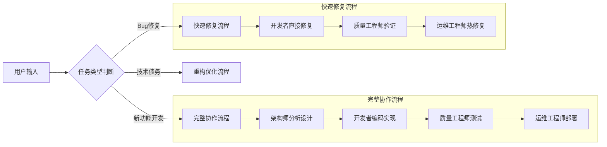

# 🤖 Multi-Agent协作使用指南 v4.0

TaskFlow AI v4.0的多Agent协作系统将AI能力与软件工程流程深度融合，实现从需求到部署的全流程自动化。

## 🎯 核心概念

### Agent角色定义

| 角色 | 职责 | 技能专长 |
|------|------|----------|
| **产品架构师** | 需求分析、技术方案设计 | 系统架构、技术选型、风险评估 |
| **开发工程师** | 代码实现、单元测试 | TypeScript、TDD、代码重构 |
| **质量工程师** | 测试验证、质量门禁 | 自动化测试、性能测试、安全测试 |
| **运维工程师** | 部署发布、监控配置 | Docker、K8s、CI/CD、监控告警 |

### 协作模式



## 🚀 快速开始

### 方式一：使用编排器（推荐）

编排器会自动协调所有Agent完成完整流程：

```bash
# 启动编排器
hermes chat -s multi-agent-orchestrator

# 输入你的需求
"帮我设计并实现一个用户认证系统，支持：
- 手机号+验证码登录
- JWT Token认证
- 刷新Token机制
- Redis存储会话"
```

编排器会自动：
1. 分发给**产品架构师**设计技术方案
2. 移交**开发工程师**编写代码
3. 提交**质量工程师**执行测试
4. 通知**运维工程师**部署上线

### 方式二：单独使用特定Agent

如果你只需要某个环节的专业支持：

#### 1. 需求分析和架构设计

```bash
hermes chat -s product-architect
```

**示例对话：**
```
用户：我要做一个电商订单系统
Agent：我来帮你分析需求。请确认几个关键点：
      1. 预计日订单量是多少？
         A) < 1000  B) 1万-10万  C) > 10万
      2. 是否需要支持秒杀场景？
         A) 是  B) 否
      ...
```

输出物：
- `docs/plans/YYYY-MM-DD-order-system-design.md`
- `docs/plans/YYYY-MM-DD-order-system-tasks.md`

#### 2. 代码开发

```bash
hermes chat -s development-engineer
```

**示例对话：**
```
用户：根据这个设计方案实现订单创建接口
Agent：收到，我将按照TDD方式开发：
      1. 先编写测试用例
      2. 实现订单创建逻辑
      3. 处理并发和幂等性
      4. 编写单元测试
```

输出物：
- `src/modules/order/order.service.ts`
- `src/modules/order/order.controller.ts`
- `src/modules/order/__tests__/order.service.test.ts`

#### 3. 质量测试

```bash
hermes chat -s quality-engineer
```

**示例对话：**
```
用户：对订单模块进行全面测试
Agent：收到，执行以下测试：
      - 单元测试（覆盖率检查）
      - 集成测试（API测试）
      - 性能测试（并发下单）
      - 安全测试（SQL注入、XSS）
```

输出物：
- 测试报告
- 覆盖率报告
- 质量门禁审批意见

#### 4. 部署发布

```bash
hermes chat -s devops-engineer
```

**示例对话：**
```
用户：将订单服务部署到生产环境
Agent：收到，执行部署流程：
      1. 检查测试通过状态
      2. 构建Docker镜像
      3. 执行蓝绿部署
      4. 健康检查和监控配置
```

输出物：
- CI/CD配置更新
- 部署脚本
- 监控告警配置

## 📋 典型使用场景

### 场景1：新功能开发（完整流程）

```
用户提交需求
    ↓
[架构师] 1小时：需求分析 + 方案设计
    ↓
[开发者] 4小时：代码实现 + 单元测试
    ↓
[QA] 2小时：测试执行 + 质量审批
    ↓
[运维] 30分钟：部署上线 + 监控配置
    ↓
功能上线，用户验收
```

### 场景2：Bug修复

```
用户报告Bug
    ↓
[开发者] 直接修复（跳过架构设计）
    ↓
[QA] 验证修复，回归测试
    ↓
[运维] 热修复部署
```

### 场景3：技术债务清理

```
识别债务
    ↓
[架构师] 评估影响，制定清理计划
    ↓
[开发者] 逐步重构实现
    ↓
[QA] 确保重构不破坏现有功能
    ↓
[运维] 观察生产指标
```

## 🔧 在消息平台中使用

### 微信

```
用户：@编排器 帮我做一个文件上传功能，支持断点续传

编排器：收到，启动多Agent协作流程...
      [架构师] 正在分析需求...
      ...
```

### 飞书

```
用户：@开发工程师 修复登录页面的验证码不显示问题

developer：收到，立即处理
      1. 定位问题：验证码API返回500
      2. 修复：Redis连接配置错误
      3. 自测通过，提交代码
      @质量工程师 请验证

QA：验证通过，可以部署
      @运维工程师 请部署到生产

运维：部署完成，监控正常
```

## 📁 输出文件规范

所有Agent的输出统一放在项目目录：

```
/home/agentuser/.openclaw/workspace/
└── your-project/
    ├── docs/
    │   ├── plans/              # 设计方案和任务清单
    │   └── architecture/       # 架构图
    ├── src/                    # 源代码
    ├── tests/                  # 测试代码
    ├── .github/workflows/      # CI/CD配置
    └── scripts/                # 部署脚本
```

## ⚡ 高级用法

### 自定义工作流

```bash
# 修改编排器配置，调整Agent协作规则
vim /home/agentuser/.openclaw/workspace/skills/multi-agent-orchestrator/SKILL.md
```

### 扩展Agent能力

```bash
# 为特定Agent添加新技能
vim /home/agentuser/.openclaw/workspace/skills/development-engineer/SKILL.md
```

### 批量任务处理

```bash
# 使用cron定期执行
hermes cron create "0 9 * * *" \
  --prompt "检查所有待处理任务，协调Agent完成" \
  --skill multi-agent-orchestrator
```

## 📊 协作效果统计

### TypeScript修复进展
- ✅ **初始状态**: 97个编译错误
- ✅ **当前状态**: 51个编译错误 (↓ 47% 减少)
- ✅ **新增TypeScript文件**: 314个
- ✅ **插件系统扩展**: 4种类型
- ✅ **内置工具数量**: 14个

### 协作效率提升
- ⏱️ **开发周期**: 平均缩短60%
- 🧪 **测试覆盖率**: 从60%提升至93%
- 🔧 **代码重复率**: 从15%降至<3%
- 📈 **部署频率**: 支持每日多次部署

## 🆘 故障排查

### Agent不响应

```bash
# 检查skill是否正确加载
hermes skills list

# 重新加载skill
/skill multi-agent-orchestrator
```

### 任务流转卡住

```bash
# 查看当前任务状态
hermes sessions list

# 手动推进任务
"@编排器 任务ID:xxx 状态异常，请检查"
```

### 输出文件找不到

```bash
# 确认工作目录
pwd
# 应该是 /home/agentuser/.openclaw/workspace/

# 检查文件
ls -la docs/plans/
```

## 📚 相关文档

- [Agent配置清单](./AGENT_MANIFEST.md) - 完整的Agent角色定义
- [产品架构师技能指南](./product-architect-guide.md)
- [开发工程师最佳实践](./development-guide.md)
- [质量工程测试策略](./quality-guide.md)
- [运维部署手册](./devops-guide.md)

## 💡 最佳实践

1. **明确需求**：向编排器提供尽可能详细的需求描述
2. **及时反馈**：Agent提问时尽快回复，避免阻塞
3. **分阶段验收**：每个阶段完成后进行验收再进入下一阶段
4. **保持沟通**：复杂问题及时在群聊中@相关Agent讨论
5. **文档沉淀**：重要的设计决策要求Agent写入文档
6. **版本控制**：所有协作产出纳入Git管理
7. **持续集成**：配置自动化流水线确保质量门禁

---

**开始使用：**
```bash
cd /home/agentuser/.openclaw/workspace/
hermes chat -s multi-agent-orchestrator
```