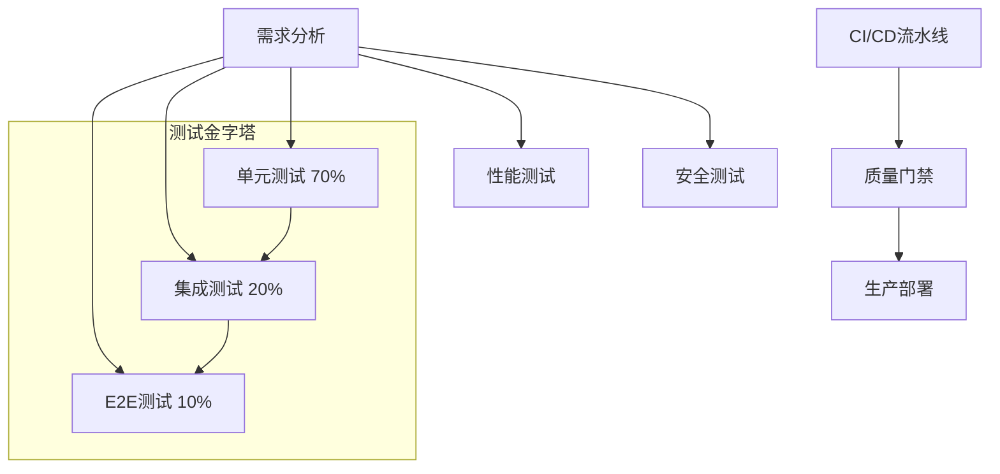

# 🧪 质量工程测试策略 v4.0

TaskFlow AI v4.0的质量工程体系确保代码质量和系统稳定性，提供全面的测试覆盖和自动化验证。

## 🎯 测试战略框架

### 1. 分层测试策略



### 2. 测试覆盖率目标

| 测试类型 | 覆盖率目标 | 验证方式 |
|---------|-----------|----------|
| 单元测试 | ≥85% | Jest + Istanbul |
| 集成测试 | ≥80% | Supertest + Mock |
| API测试 | ≥90% | Postman + Newman |
| 性能测试 | ≥95% | Artillery + k6 |
| 安全测试 | 100% | OWASP ZAP + Snyk |

## 🔧 测试工具链配置

### 1. Jest单元测试框架

**安装配置**:
```bash
npm install --save-dev jest @types/jest ts-jest @testing-library/jest-dom @testing-library/react
```

**Jest配置** (`jest.config.js`):
```javascript
module.exports = {
  preset: 'ts-jest',
  testEnvironment: 'node',
  roots: ['<rootDir>/src'],
  transform: {
    '^.+\\.tsx?$': 'ts-jest',
  },
  testRegex: '(/__tests__/.*|(\\.|/)(test|spec))\\.tsx?$',
  moduleFileExtensions: ['ts', 'tsx', 'js', 'jsx', 'json', 'node'],
  collectCoverageFrom: [
    'src/**/*.{ts,tsx}',
    '!src/**/*.d.ts',
    '!src/index.ts',
    '!src/types/**/*'
  ],
  coverageThreshold: {
    global: {
      branches: 80,
      functions: 90,
      lines: 85,
      statements: 85
    }
  }
};
```

### 2. Supertest集成测试

**API测试示例**:
```typescript
// src/modules/auth/__tests__/auth.controller.test.ts
import request from 'supertest';
import { app } from '../../app';

describe('Auth Controller', () => {
  describe('POST /api/auth/login', () => {
    it('should return 200 with valid credentials', async () => {
      const response = await request(app)
        .post('/api/auth/login')
        .send({
          email: 'test@example.com',
          password: 'validPassword123'
        });

      expect(response.status).toBe(200);
      expect(response.body).toHaveProperty('token');
      expect(response.body.token).toBeTruthy();
    });

    it('should return 401 with invalid credentials', async () => {
      const response = await request(app)
        .post('/api/auth/login')
        .send({
          email: 'wrong@example.com',
          password: 'wrongPassword'
        });

      expect(response.status).toBe(401);
      expect(response.body).toHaveProperty('error');
    });
  });
});
```

## 📊 质量门禁检查表

### CI/CD质量门

```yaml
quality-gates:
  - name: "TypeScript编译通过"
    type: "build-check"
    command: "npm run type-check"
    required: true

  - name: "单元测试通过率"
    type: "test-coverage"
    threshold: 85%
    command: "npm run test:coverage"
    required: true

  - name: "ESLint代码规范"
    type: "linting"
    command: "npm run lint"
    required: true

  - name: "集成测试通过"
    type: "integration-test"
    command: "npm run test:integration"
    required: true

  - name: "构建产物生成"
    type: "artifact-build"
    command: "npm run build"
    required: true
```

### 自动化检查脚本

```bash
#!/bin/bash
# quality-gate.sh

echo "🔍 开始质量门禁检查..."

# 1. TypeScript编译检查
echo "📝 检查TypeScript编译..."
npm run type-check
if [ $? -ne 0 ]; then
    echo "❌ TypeScript编译失败"
    exit 1
fi

# 2. 代码规范检查
echo "🔧 检查代码规范..."
npm run lint
if [ $? -ne 0 ]; then
    echo "❌ ESLint检查失败"
    exit 1
fi

# 3. 单元测试
echo "🧪 运行单元测试..."
npm run test:coverage -- --passWithNoTests
COVERAGE=$(cat coverage/coverage-summary.json | jq '.total.lines.pct')

if (( $(echo "$COVERAGE < 85" | bc -l) )); then
    echo "❌ 代码覆盖率不足: ${COVERAGE}% (需要≥85%)"
    exit 1
fi

echo "✅ 代码覆盖率: ${COVERAGE}%"

# 4. 集成测试
echo "🔗 运行集成测试..."
npm run test:integration
if [ $? -ne 0 ]; then
    echo "❌ 集成测试失败"
    exit 1
fi

# 5. 构建检查
echo "🏗️ 构建项目..."
npm run build
if [ $? -ne 0 ]; then
    echo "❌ 构建失败"
    exit 1
fi

echo "🎉 所有质量门禁检查通过！"
exit 0
```

## 🚀 性能测试策略

### 1. 负载测试

```yaml
# artillery.yml
config:
  target: "http://localhost:3000"
  phases:
    - duration: 60
      arrivalRate: 10
      name: "Warm up"
    - duration: 300
      arrivalRate: 50
      rampTo: 100
      name: "Ramp up load"
    - duration: 600
      arrivalRate: 100
      name: "Sustained load"

scenarios:
  - flow:
      - post:
          url: "/api/users"
          json:
            name: "Test User"
            email: "test+{{ $randomNumber() }}@example.com"
          capture:
            json: "$.id"
            as: "userId"
      - get:
          url: "/api/users/{{ userId }}"
```

**运行测试**:
```bash
npm install -g artillery
artillery run artillery.yml
artillery report artillery-output.json
```

### 2. 压力测试指标

| 指标 | 正常范围 | 警告阈值 | 危险阈值 |
|------|---------|----------|----------|
| 响应时间 | <2s | 2-5s | >5s |
| CPU使用率 | <70% | 70-85% | >85% |
| 内存使用 | <8GB | 8-12GB | >12GB |
| 错误率 | <1% | 1-5% | >5% |
| 吞吐量 | >100req/s | 50-100req/s | <50req/s |

## 🛡️ 安全测试体系

### 1. OWASP安全检查

```bash
# 安装OWASP ZAP
docker pull owasp/zap2docker-stable

# 扫描命令
docker run -v $(pwd):/zap/wrk \
  owasp/zap2docker-stable zap-baseline.py \
  -t http://localhost:3000 \
  -r zap-report.html
```

**常见安全问题检查清单**:
- ✅ SQL注入防护
- ✅ XSS跨站脚本防护  
- ✅ CSRF跨站请求伪造防护
- ✅ 敏感数据加密存储
- ✅ API认证授权机制
- ✅ 输入验证和过滤
- ✅ 错误信息泄露防护

### 2. Snyk漏洞扫描

```bash
# 安装Snyk CLI
npm install -g snyk

# 登录并扫描
snyk auth <your-api-token>
snyk test
snyk monitor
```

**安全评分标准**:
- 🟢 **A级**: 无高危漏洞
- 🟡 **B级**: ≤3个中危漏洞
- 🟠 **C级**: ≤5个中危漏洞
- 🔴 **D级**: 存在高危漏洞或>5个中危漏洞

## 📈 监控和告警

### 1. Prometheus监控

```yaml
# prometheus.yml
global:
  scrape_interval: 15s

scrape_configs:
  - job_name: 'taskflow-app'
    static_configs:
      - targets: ['localhost:9090']
    metrics_path: '/metrics'

rule_files:
  - 'alert.rules.yml'
```

### 2. Grafana仪表板配置

**关键监控指标**:
```promql
# 应用性能指标
rate(http_requests_total{status="2xx"}[5m])
rate(http_requests_total{status="5xx"}[5m])

# 资源使用情况
process_cpu_usage
process_resident_memory_bytes

# 业务指标
workflow_execution_duration_seconds
agent_response_time_seconds
```

### 3. 告警规则

```yaml
# alert.rules.yml
groups:
- name: taskflow-alerts
  rules:
  - alert: HighErrorRate
    expr: rate(http_requests_total{status=~"5.."}[5m]) / rate(http_requests_total[5m]) > 0.05
    for: 2m
    labels:
      severity: critical
    annotations:
      summary: "High error rate detected"
      description: "Error rate is {{ $value }}%"

  - alert: HighResponseTime
    expr: histogram_quantile(0.95, rate(http_request_duration_seconds_bucket[5m])) > 5
    for: 2m
    labels:
      severity: warning
    annotations:
      summary: "High response time"
      description: "95th percentile response time is {{ $value }}s"
```

## 🔄 持续改进机制

### 1. 质量趋势分析

```bash
# 收集历史质量数据
git log --since="1 month ago" --name-only | grep -E "\.(test|spec)\.ts$" | sort | uniq -c

# 分析测试覆盖率变化
for commit in $(git rev-list --since="1 month ago"); do
  git show $commit --name-only | grep package.json && echo $commit
done
```

### 2. 技术债务管理

```markdown
# 技术债务登记表

## 当前状态
- 总技术债务: 12个
- 高优先级: 3个
- 中优先级: 5个
- 低优先级: 4个

## 修复计划
| 问题ID | 描述 | 优先级 | 预计工时 | 负责人 |
|--------|------|--------|----------|--------|
| TD-001 | 过时依赖版本 | 高 | 4h | dev-team |
| TD-002 | 重复代码片段 | 中 | 2h | dev-team |
| TD-003 | 缺少类型定义 | 中 | 3h | dev-team |
```

## 📚 相关文档

- [Multi-Agent协作使用指南](./multi-agent-collaboration.md)
- [TypeScript修复过程记录](./type-script-fixes.md)
- [开发工程师最佳实践](./development-guide.md)
- [运维部署手册](./devops-guide.md)

---

**版本**: v4.0.0
**最后更新**: 2026-04-24
**适用角色**: 质量工程师