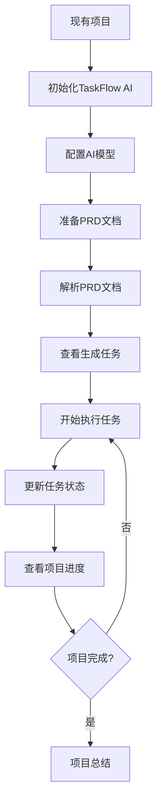
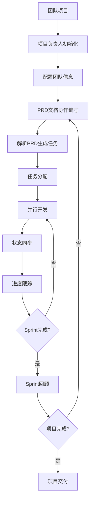
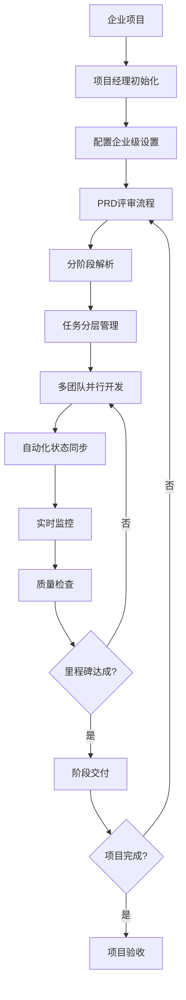

# 工作流程指南

## 概述

本指南介绍TaskFlow AI在不同场景下的标准工作流程，帮助个人开发者和团队建立高效的PRD解析和任务管理流程。

## 🚀 基础工作流程

### 个人开发者工作流

适用于独立开发者管理个人项目的场景。



#### 详细步骤

**1. 项目集成**
```bash
# 进入现有项目目录
cd my-personal-project

# 初始化TaskFlow AI
taskflow init

# 验证初始化
ls -la .taskflow/
```

**2. 环境配置**
```bash
# 配置主要AI模型
taskflow config set models.deepseek.apiKey "your-deepseek-key"

# 设置项目信息
taskflow config set project.name "我的个人项目"
taskflow config set project.type "web-app"

# 验证配置
taskflow config validate
```

**3. PRD准备和解析**
```bash
# 创建或准备PRD文档
# 确保文档结构清晰，包含功能需求和验收标准

# 解析PRD文档
taskflow parse docs/requirements.md

# 查看解析结果
taskflow status list
```

**4. 任务执行循环**
```bash
# 获取下一个任务
taskflow status next

# 开始任务
taskflow status update task-001 in_progress

# 完成任务
taskflow status update task-001 completed --comment "功能实现完成"

# 查看整体进度
taskflow status progress
```

### 小团队工作流

适用于2-5人的小型开发团队。



#### 详细步骤

**1. 团队项目设置**
```bash
# 项目负责人初始化
cd team-project
taskflow init

# 配置团队信息
taskflow config set team.members '["张三", "李四", "王五"]'
taskflow config set project.name "团队项目"

# 配置多个AI模型（提高可用性）
taskflow config set multiModel.enabled true
taskflow config set multiModel.primary "deepseek"
taskflow config set multiModel.fallback '["zhipu", "qwen"]'
```

**2. 协作PRD编写**
```bash
# 团队协作编写PRD文档
# 使用Git管理PRD文档版本
git add docs/requirements.md
git commit -m "更新PRD文档"

# 解析最新PRD
taskflow parse docs/requirements.md --multi-model
```

**3. 任务分配和管理**
```bash
# 查看所有任务
taskflow status list

# 分配任务给团队成员
taskflow status update task-001 in_progress --assignee "张三"
taskflow status update task-002 in_progress --assignee "李四"

# 查看团队进度
taskflow status progress --detailed
```

**4. 日常同步**
```bash
# 每日站会前查看进度
taskflow status progress

# 查看阻塞任务
taskflow status list --filter status=blocked

# 更新任务状态
taskflow status update task-001 completed --comment "前端组件完成"
```

## 🏢 企业级工作流程

### 大型团队工作流

适用于10人以上的大型开发团队。



#### 企业级配置

**1. 高级项目设置**
```bash
# 企业级初始化
taskflow init --verbose

# 配置企业级功能
taskflow config set enterprise.enabled true
taskflow config set enterprise.teamSize "large"

# 配置多环境支持
taskflow config env production
taskflow config set multiModel.loadBalancing true
taskflow config set performance.cacheSize 1000
```

**2. 权限和安全配置**
```bash
# 启用安全功能
taskflow config set security.encryptApiKeys true
taskflow config set security.auditLog.enabled true

# 配置团队角色
taskflow config set team.roles '["admin", "pm", "developer", "tester"]'
```

**3. 自动化工作流**
```bash
# 设置自动化规则
taskflow automation create --trigger "prd-updated" --action "re-parse"
taskflow automation create --trigger "task-completed" --action "notify-team"

# 配置定时报告
taskflow schedule create --name "daily-report" --cron "0 9 * * *"
```

### 敏捷开发工作流

结合Scrum/Kanban方法论的工作流程。

#### Sprint规划流程

**1. Sprint开始**
```bash
# 创建新Sprint
taskflow sprint create --name "Sprint-2024-01" --duration "2-weeks"

# 从Backlog选择任务
taskflow status list --filter priority=high
taskflow sprint add-tasks task-001,task-002,task-003

# Sprint规划会议
taskflow status progress --sprint "Sprint-2024-01" --forecast
```

**2. Sprint执行**
```bash
# 每日站会
taskflow status progress --daily-summary

# 任务状态更新
taskflow status update task-001 in_progress --assignee "张三"

# 阻塞问题处理
taskflow status update task-002 blocked --comment "等待API接口"
```

**3. Sprint回顾**
```bash
# Sprint结束统计
taskflow sprint complete "Sprint-2024-01"

# 生成Sprint报告
taskflow reports generate sprint-summary --sprint "Sprint-2024-01"

# 团队回顾数据
taskflow analyze team-velocity --sprint "Sprint-2024-01"
```

## 🔄 持续集成工作流

### CI/CD集成

将TaskFlow AI集成到持续集成流程中。

**1. Git Hooks集成**
```bash
# 安装Git钩子
taskflow hooks install --type pre-commit

# 配置自动解析
echo '#!/bin/bash
if git diff --cached --name-only | grep -q "docs/.*\.md"; then
  taskflow parse docs/requirements.md --auto-update
fi' > .git/hooks/pre-commit
```

**2. GitHub Actions集成**
```yaml
# .github/workflows/taskflow.yml
name: TaskFlow AI Integration
on:
  push:
    paths: ['docs/**/*.md']
  
jobs:
  update-tasks:
    runs-on: ubuntu-latest
    steps:
      - uses: actions/checkout@v3
      - name: Setup TaskFlow AI
        run: |
          npm install -g taskflow-ai
          taskflow init
      - name: Parse PRD
        run: taskflow parse docs/requirements.md
      - name: Update Tasks
        run: taskflow status sync --remote
```

### 自动化监控

**1. 进度监控**
```bash
# 设置进度告警
taskflow alerts create --condition "progress < 50%" --action "notify-pm"

# 配置Slack通知
taskflow integrations enable slack --webhook-url "https://hooks.slack.com/..."

# 自动化报告
taskflow reports schedule weekly-progress --recipients "pm@company.com"
```

**2. 质量监控**
```bash
# 任务质量检查
taskflow quality check --criteria "completion-rate,accuracy"

# 自动化测试集成
taskflow hooks create --trigger "task-completed" --action "run-tests"
```

## 📊 项目类型特定工作流

### 前端项目工作流

**特点**: 组件化开发，UI/UX重点

```bash
# 前端项目配置
taskflow config set project.type "frontend"
taskflow config set project.framework "react"

# 前端特定的任务模板
taskflow templates create --name "component" --type "frontend"

# UI组件任务解析
taskflow parse ui-requirements.md --focus "components,styling,interactions"
```

### 后端API项目工作流

**特点**: 接口设计，数据处理重点

```bash
# 后端项目配置
taskflow config set project.type "backend"
taskflow config set project.framework "express"

# API文档解析
taskflow parse api-spec.md --focus "endpoints,data-models,authentication"

# 数据库任务管理
taskflow tasks create --template "database-migration"
```


## 🔧 工作流优化

### 效率提升技巧

**1. 快捷命令设置**
```bash
# 创建命令别名
alias tf='taskflow'
alias tfs='taskflow status'
alias tfp='taskflow parse'

# 常用命令组合
alias tf-daily='taskflow status progress && taskflow status next'
alias tf-update='git pull && taskflow parse docs/requirements.md'
```

**2. 自动化脚本**
```bash
#!/bin/bash
# daily-workflow.sh
echo "📅 每日工作流程开始"

# 更新代码
git pull

# 检查PRD更新
if git diff HEAD~1 --name-only | grep -q "docs/.*\.md"; then
  echo "📄 检测到PRD更新，重新解析..."
  taskflow parse docs/requirements.md
fi

# 显示今日任务
echo "📋 今日任务:"
taskflow status next --count 3

# 显示项目进度
echo "📊 项目进度:"
taskflow status progress
```

### 团队协作优化

**1. 配置同步**
```bash
# 导出团队配置模板
taskflow config export --template team-config.json

# 团队成员导入配置
taskflow config import team-config.json

# 配置版本控制
git add .taskflow/config.json
git commit -m "更新团队配置"
```

**2. 沟通集成**
```bash
# Slack集成
taskflow integrations enable slack
taskflow notifications create --channel "#dev-team" --events "task-completed"

# 邮件通知
taskflow notifications create --email "team@company.com" --events "milestone-reached"
```

## 📈 工作流分析

### 效率指标

**1. 团队效率分析**
```bash
# 团队速度分析
taskflow analyze velocity --period "last-month"

# 任务完成率
taskflow analyze completion-rate --by-member

# 瓶颈识别
taskflow analyze bottlenecks --threshold 0.7
```

**2. 项目健康度**
```bash
# 项目健康检查
taskflow health check --comprehensive

# 风险评估
taskflow analyze risks --factors "timeline,resources,dependencies"

# 预测分析
taskflow forecast completion --based-on "current-velocity"
```

## 🎯 最佳实践总结

### 工作流设计原则

1. **标准化**: 建立团队统一的工作流程
2. **自动化**: 减少重复性手工操作
3. **可视化**: 提供清晰的进度和状态展示
4. **灵活性**: 支持不同项目类型的定制
5. **持续改进**: 定期回顾和优化工作流程

### 常见陷阱避免

1. **过度复杂化**: 保持工作流程简单有效
2. **缺乏同步**: 确保团队成员及时更新状态
3. **忽视反馈**: 定期收集和处理团队反馈
4. **配置不一致**: 维护统一的团队配置

## 📚 相关文档

- [基本使用指南](./basic-usage.md) - 基础功能使用
- [CLI命令详解](./cli-commands.md) - 详细命令说明
- [最佳实践](./best-practices.md) - 使用最佳实践
- [故障排除](../troubleshooting/common-issues.md) - 常见问题解决
